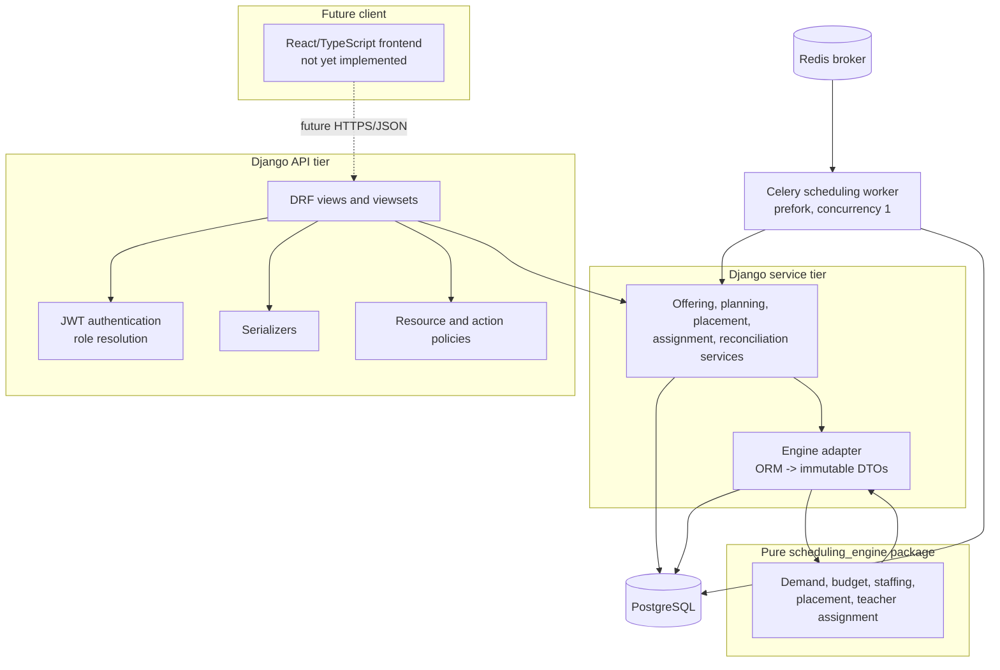
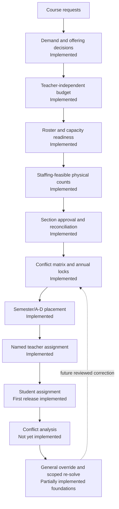
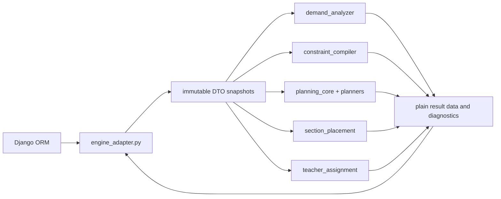
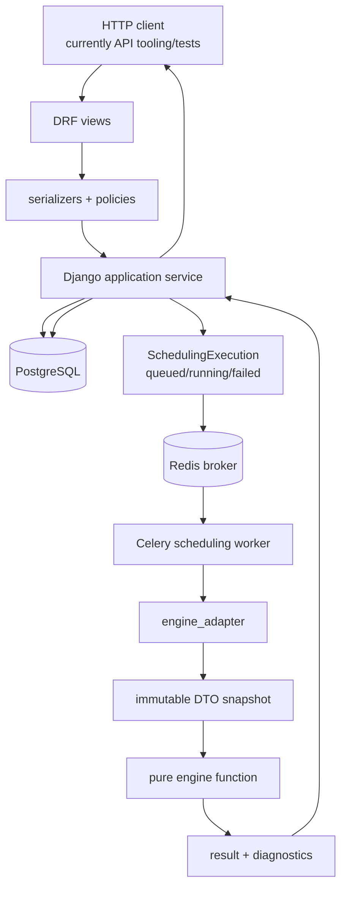
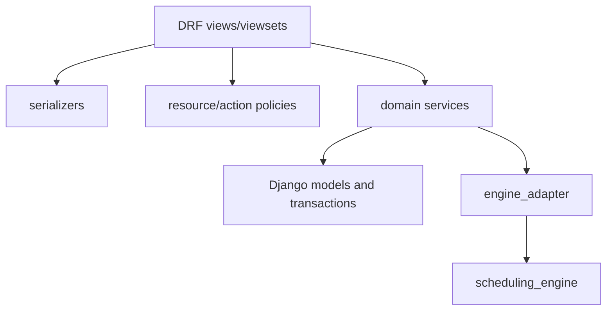

# Software Design Document
## Intelligent School Timetabling System (Ontario Secondary Schools)

**Document type:** Current-state Software Design Document
**Version:** 2.0
**Status:** Repository-backed architecture reference
**Snapshot:** 2026-08-31
**Representative scale:** the repository includes mixed synthetic fixtures with
approximately 1,400 students and 300+ sections; teacher deployment scale and
real-school performance remain to be measured.

This document describes the system that is actually implemented in this
repository, together with the boundaries of the next stages. It is not a
greenfield architecture proposal. The repository and automated tests are the
source of truth for implementation status. The accepted decision records in
`docs/decisions/` supersede older wording in this document where they differ.

Status labels used below have precise meanings:

- **Implemented** means working code exists and automated tests cover it.
- **Partially implemented** means useful foundations exist but the end-to-end
  counselor capability is not complete.
- **Not yet implemented** means no working end-to-end capability exists. A
  model, DTO field, policy name, or planned module alone does not count.

---

## Table of Contents

1. Executive Summary
2. Project Goals
3. Scope
4. Functional Requirements
5. Non-Functional Requirements
6. System Overview
7. High-Level Architecture
8. Architectural Principles
9. Major Components
10. Detailed Component Responsibilities
11. User Roles
12. User Workflows
13. Internal Scheduling Pipeline
14. Scheduling Engine Architecture
15. Data Flow
16. Database Integration
17. API Design
18. Frontend Architecture
19. Backend Architecture
20. Optimization Engine Architecture
21. Manual Override Workflow
22. Error Handling Strategy
23. Logging Strategy
24. Security Considerations
25. Performance Considerations
26. Scalability Considerations
27. Future Expansion
28. Risks and Trade-offs
29. Development Roadmap
30. Conclusion

---

## 1. Executive Summary

The implemented system is a counselor-controlled decision-support pipeline for
Ontario secondary-school scheduling. It does not attempt to produce one
unreviewable timetable. Each implemented solver stage creates an immutable,
reviewable recommendation, and an authorized approval transaction turns the
accepted recommendation into operational state.

The current working pipeline is:

```text
course requests
  -> demand and year-specific offering decisions
  -> teacher-independent section budget
  -> ready teacher roster and staffing-feasible physical counts
  -> section approval and reconciliation
  -> semester/A-D placement with anonymous staffing feasibility
  -> named teacher assignment
  -> student assignment and controlled reruns
```

Section counting, section lifecycle/reconciliation, semester/A-D placement,
named teacher assignment, and student assignment are implemented. Placement
writes timeslot-only `SectionSchedule` rows. Named teacher approval writes
`Section.teacher` only after a separate complete run has been reviewed.
Student-assignment controlled reruns add active/historical enrollment history,
six audited lock types, scoped reruns, review-only what-if checks, and
transactional replacement provenance. Room assignment, post-solve conflict
analysis, a general manual-override workflow, and the frontend are not yet
implemented end-to-end.

The backend is Django and Django REST Framework over PostgreSQL. The
`scheduling_engine` package is pure Python and independent of Django. The
expensive placement, named-teacher, and student-assignment API operations are
dispatched through a dedicated Celery/Redis queue and tracked by a durable
`SchedulingExecution` row; the immutable stage run is still created by the
existing service in the worker. Direct service callers remain synchronous.
See `docs/SCHEDULING_WORKERS.md` for the worker lifecycle and local setup.

---

## 2. Project Goals

The design goals are:

| Goal | Current interpretation |
|---|---|
| Counselor control | Solver output remains a recommendation until a planning-role user explicitly approves it. |
| Reviewability | Runs store the input snapshot, result, diagnostics, and solver metadata needed for review. |
| Stable history | Approvals and audit rows are append-only; section reconciliation retires rather than deletes surplus generated sections. |
| Staged computation | Section counts, placement, named teacher assignment, first-release student assignment, and controlled student reruns are independent reviewed stages. Conflict analysis remains a later stage. |
| Safe authorization | Resource and action policies fail closed, and policy filtering occurs before client query filtering. |
| Explainable failure | Stable diagnostic and workflow codes accompany human-readable messages. |
| Maintainable engine boundary | Django owns persistence and orchestration; the pure engine consumes immutable DTOs and returns plain result data. |
| Appropriate scale | The repository uses representative single-school fixtures, including a mixed 1,400-student/300+ section benchmark. Stage 1 and Stage 2 use bounded CP-SAT searches and must return complete, hard-valid results; independent diagnostic parallel runs may differ, while objective facts and persisted invariants remain the quality evidence. Real-school and deployment measurements remain required. |

The project also preserves a migrationless pre-production schema workflow:
project apps do not contain migration files, and an authorized local schema
rebuild uses `migrate --run-syncdb`. Model changes must not silently generate
migrations.

---

## 3. Scope

### 3.1 In Scope and Implemented

- JWT authentication and centralized application-role resolution.
- Fail-closed resource and named-action authorization.
- Academic years, rooms, courses, sections, students, teachers, counselors,
  requests, enrollments, prerequisites, historical demand, constraints,
  qualifications, availability, preferences, locks, schedules, and audit data.
- Year-specific course offerings, cancellation/restoration, approved course
  combinations, physical delivery groups, and backup-request resolution.
- Demand aggregation and staffing-aware annual and semester section planning.
- Immutable planning runs, approvals, generated section provenance, and
  section-plan reconciliation with active/retired lifecycle semantics.
- Annual placement locks and counselor-reviewed semester/A-D placement.
- Counselor-reviewed named teacher assignment after accepted placement.
- Counselor-reviewed student-to-section assignment with immutable enrollment approval provenance, plus controlled reruns with active/historical enrollment state, locks, scoped input, review-only what-if checks, and replacement provenance.
- API tests for role access, workflow validation, transactional approval, and
  relevant pure-engine contracts.

### 3.2 Partially Implemented

- Conflict management: the yearly `CourseConflictMatrix` and counselor score
  adjustment workflow exist, while automatic acceptance of engine-generated
  recommendations is intentionally not present.
- Manual controls: `SectionLock`, `Section.is_locked`, `ManualOverride`
  foundations, and student-assignment locks/scoped reruns exist, but there is
  no general cross-stage override application service or override-history
  endpoint.
- Internationalization: the `Translation` model and admin registration exist,
  but no translation API or consuming user interface exists.
- Operational hardening: tests, local setup, immutable run records,
  transaction boundaries, durable asynchronous execution state, Redis/Celery
  dispatch, idempotency, and clean worker-child recycling exist; CI,
  production settings split, generated API contract, and full deployment
  hardening remain future work.

### 3.3 Not Yet Implemented

- Room assignment.
- A composed timetable or personal schedule endpoints.
- A read-only post-solve conflict analyzer.
- General manual override application and genuine scoped re-solving.
- A React/TypeScript frontend.
- Background execution for placement, named-teacher assignment, and student
  assignment is implemented through the scheduling worker. Broader queue
  orchestration, cancellation, progress reporting, and a frontend remain
  future work.

The repository contains models and policy names related to some of these areas,
but those foundations do not constitute an implemented capability.

---

## 4. Functional Requirements

| ID | Requirement | Status | Evidence or boundary |
|---|---|---|---|
| FR-1 | Submit primary and alternate course requests by academic year. | Implemented | `CourseRequestViewSet`, ownership policies, and `backend/tests/test_course_request_api.py`. |
| FR-2 | Aggregate demand and support offering cancellation/combination review. | Implemented | `backend/apps/courses/services/demand.py`, `offerings.py`, and upstream workflow tests. |
| FR-3 | Recommend annual and semester section counts from demand, capacities, priorities, and staffing. | Implemented | `section_planner.py`, `section_budget_planner.py`, `staffing_planner.py`, and planning tests. |
| FR-4 | Explain whether recommended physical counts fit the confirmed qualified teacher capacity. | Implemented | Anonymous staffing feasibility results and `StaffingPlanRun` review/approval. |
| FR-5 | Capture teacher preferences, current courses, availability, qualifications, and planning capacities. | Implemented | Nested teacher constraint APIs and scheduling configuration endpoints. |
| FR-6 | Capture hard/soft constraints, course conflicts, section locks, and annual placement locks. | Partially implemented | CRUD and lock workflows exist; the `Section.is_locked`/`SectionLock` synchronization invariant and general override workflow remain unresolved. |
| FR-7 | Place active sections in semesters and recurring A-D timeslots while proving anonymous staffing feasibility. | Implemented | `section_placement.py`, placement run/approval services, and placement tests. Rooms are deliberately excluded. |
| FR-8 | Assign named teachers after accepted placement. | Implemented | `teacher_assignment.py`, named-teacher decision record, and teacher-assignment tests. |
| FR-9 | Assign students to sections while respecting capacity, prerequisites, and block conflicts. | Implemented first release plus controlled reruns | Immutable run/review/approval, active/historical enrollment state, six audited lock types, scope, priorities, preservation, stable diagnostics, and replacement provenance exist; transcript evidence remains deferred. |
| FR-10 | Produce a derived report of unresolved timetable conflicts and issues. | Not yet implemented | No conflict-analyzer module or conflict-report endpoint exists. |
| FR-11 | Apply a manual change and re-solve only the affected scope. | Partially implemented | Student-assignment locks and scoped reruns exist; no general cross-stage override application service or cross-stage scope contract exists. |
| FR-12 | Persist manual and automated decisions with reason, actor, and before/after evidence. | Partially implemented | Planning, placement, teacher-assignment, offering, and reconciliation audit models exist; general override history is incomplete. |
| FR-13 | Serve bilingual user-interface text through translations. | Partially implemented | `Translation` model/admin exist; translation API, frontend, and UI consumption do not. |
| FR-14 | Let teachers and students view their own finalized schedules. | Not yet implemented | Student assignment exists, but no composed timetable or personal schedule endpoint exists. |

---

## 5. Non-Functional Requirements

| Category | Current status and design |
|---|---|
| Performance | CP-SAT stages use bounded solver calls. Student assignment first obtains and validates a complete hard-feasible seed, then runs the existing lexicographic objective sequence with bounded parallel search. A timeout retains the best complete incumbent; target-scale quality is reported through persisted stage/objective facts and hard-validity checks. Objective Semantics v2 is an explicit opt-in: it keeps fulfillment and hard feasibility unchanged while normalizing the five school-wide soft penalties onto a common engine-owned scale and applying one canonical counselor score. |
| Scalability | Expensive downstream solves use a dedicated Celery queue with one process-based worker slot and one heavy task per child. Horizontal worker scaling is intentionally deferred pending resource measurement. The Django-free student-assignment diagnostic path reports compact psutil-backed process/system resource facts; these are observational and never authoritative over CP-SAT results. |
| Maintainability | The engine is Django-free, the adapter is the ORM-to-DTO boundary, and services own multi-model workflows. These boundaries are covered by import and service tests. |
| Auditability | Immutable run, approval, placement, teacher-assignment, offering, staffing, and reconciliation records preserve accepted decisions. General override history remains incomplete. |
| Authorization | Every API resource/action must declare a policy; missing declarations fail closed. Policy scopes are tested at policy and endpoint levels. |
| Transactional integrity | Approval and reconciliation writes use Django transactions and stale-input revalidation. Rollback behavior is tested for the implemented workflows. |
| Availability | CRUD and review/approval do not depend on a worker. Expensive downstream solve requests return a durable queued execution; broker/worker failures remain distinct from solver outcomes. Cancellation, progress, and stale-running reconciliation remain future work. |
| Internationalization | Translation storage exists, but no runtime translation boundary is implemented. |
| Usability | Review payloads include recommendations, accepted values, diagnostics, and conflicts for implemented stages. No counselor frontend exists yet. |
| Schema development | Project apps intentionally use the migrationless `migrate --run-syncdb` workflow. |

The Objective Semantics v2 adaptive local-search allocator is currently an
offline diagnostic wrapper around existing CP-SAT neighborhood operators. It
is not part of the production workflow, persistence, approval, or API
contract. Its policy may choose where to search, but CP-SAT and unchanged
full-model validation remain the only authorities for accepting a candidate.

The pure engine also provides a continuous operator-session diagnostic for
repeatable offline characterization. It reuses one immutable model/context
boundary across bounded R2 and targeted R4/R8 S1/S2 probes, retargeting only
from the current validated incumbent when configured for dynamic targeting.
The session budget includes setup and validation, and its structured facts
separate CP-SAT time, validation time, total elapsed time, and native-call
overrun. This facility is intentionally outside ordinary scheduling,
persistence, approval, and API behavior; it cannot authorize a candidate or
alter Objective Semantics v2.

---

## 6. System Overview

The current system has three operational patterns:

1. **Data and configuration:** authenticated users call DRF endpoints to create
   requests, manage offerings, configure capacities and qualifications, set
   conflicts, manage rosters, and create locks. Views validate transport shape
   and delegate workflow operations to Django services.
2. **Asynchronous expensive recommendation:** a planning-role request validates
   transport data, persists a `SchedulingExecution`, and publishes only its
   ID after commit. The worker reloads the stable payload, invokes the Django
   service, which loads a detached DTO snapshot through
   `backend/apps/scheduling/services/engine_adapter.py`, calls a pure engine
   function, and persists an immutable run/result record. No operational
   sections, schedules, teachers, or enrollments are written by run creation.
3. **Review and approval:** a counselor/director reviews the stored result,
   optionally adjusts allowed selections, previews approval, and applies an
   unchanged complete result in a transaction. Approval writes only the
   stage's operational state.

The implemented sequence reaches first-release student assignment. Room
assignment, conflict analysis, composed timetables, and frontend presentation
remain future work. The engine never reads PostgreSQL directly and never
performs ORM writes.

---

## 7. High-Level Architecture

The current architecture is a layered Django application with a dedicated
Celery scheduling worker. The frontend box is a future client, not a deployed
repository component.



Placement, named-teacher, and student-assignment API submissions return a
`SchedulingExecution` identifier. The worker is configured with one heavy task
per child (`max_tasks_per_child=1`) because representative CP-SAT runs showed
native-memory retention when large solves were repeated in one process.

---

## 8. Architectural Principles

| Principle | Current application |
|---|---|
| Django owns operational state | Models, services, transactions, approvals, audit rows, and authorization remain in the backend. |
| Views stay thin | DRF views parse requests, select serializers/policies, call services, and serialize responses. |
| Engine purity | `scheduling_engine` imports no Django, DRF, ORM model, or backend module. |
| Adapter boundary | `engine_adapter.py` loads ORM state into immutable DTO snapshots and is the only integration boundary for current solver stages. |
| Pipeline over monolith | Section counts, placement, and named teacher assignment are separate runs with separate approvals. |
| Recommendation before mutation | Run creation writes immutable evidence; approval writes operational state. |
| Fixed context is shared | `backend/apps/courses/services/section_state.py` defines fixed-section behavior for downstream workflows. |
| Fail closed | Unknown roles, missing policies, missing senior qualifications, stale approvals, and invalid locks fail rather than guessing. |
| Stable machine contracts | API and solver behavior keys off stable snake_case codes rather than English message text. |
| Human review | Conflict/diagnostic data is surfaced for a counselor; the system does not silently merge courses, assign rooms, or replace accepted work. |
| Measured infrastructure | Expensive downstream solves use the dedicated scheduling queue; Celery concurrency remains one and child recycling is explicit. |
| Migrationless development | Model changes are synchronized through an explicit local rebuild; migration files are not generated incidentally. |
| Student-schedule quality | Difficulty and category distribution are snapshot soft preferences. Difficulty uses metadata or recency-weighted leave-one-course-out historical evidence, then honors a counselor override; neither objective weakens fulfillment, capacity, collisions, prerequisites, locks, or fixed context. |

---

## 9. Major Components

### 9.1 Frontend

No frontend directory or client application exists in this repository. A future
React/TypeScript client is expected to consume the snake_case API contract,
use explicit API adapters/mappers, and preserve server-side authorization. It
must represent recommendation, review, approval, diagnostics, stale state, and
accepted state separately.

### 9.2 Backend

The Django/DRF backend owns authentication, role resolution, policy filtering,
serializer validation, domain services, immutable workflow records, and
transactional operational writes. The backend contains the current HTTP API and
the ORM-to-engine adapter.

### 9.3 Database

PostgreSQL stores domain entities, configuration, immutable run snapshots and
results, approvals, section lifecycle history, placement/teacher-assignment
provenance, constraints, locks, and audit decisions. The actual model groups
are described in Section 16.

### 9.4 Scheduling Engine

The `scheduling_engine` package is a pure Python package built around immutable
dataclasses and OR-Tools CP-SAT where optimization is required. It currently
implements demand analysis, section-count planning, physical budget planning,
staffing feasibility, semester/A-D placement, named teacher assignment, and
first-release student assignment. Conflict analysis does not yet have an engine
module.

### 9.5 Supporting Components

The repository also contains:

- SimpleJWT authentication and `/api/me/` role/profile resolution;
- policy modules under `backend/apps/access/`;
- common reference-data services for academic years and rooms;
- normalized qualification review and compiler support;
- translation storage under `backend/apps/translations/`; and
- Django admin registrations for major domain/configuration models.

The scheduling application now includes a Redis-backed Celery task broker and
one process-recycling scheduling worker boundary for expensive downstream
solve submissions. Notification, frontend, and production observability
stacks remain outside the repository.

---

## 10. Detailed Component Responsibilities

| Component | Responsibilities | Does not currently do |
|---|---|---|
| DRF views/viewsets | Authentication integration, policy declaration, request/response handling, serializer selection, service invocation, pagination, and route actions. | Solve optimization, perform broad domain orchestration, or provide a frontend. |
| Serializers | Validate transport shape and reusable field/cross-field rules; expose the runtime API field names. | Replace service-level current-state validation or authorize a queryset. |
| Resource policies | Scope reads and writes by role/ownership/assignment before query parameters are applied. | Act as a substitute for object-level business workflows. |
| Action policies | Authorize named workflow actions such as starting/approving implemented scheduling stages. | Implement the future manual override workflow merely because action names exist. |
| Django services | Own offering transitions, run creation, snapshotting, approval, reconciliation, lock changes, roster readiness, and transactional writes. | Put CP-SAT modeling in Django. |
| Engine adapter | Load current ORM facts, build immutable DTOs, calculate fingerprints, and expose stage-specific input snapshots. | Provide a generic job queue or persist engine state directly from pure code. |
| Pure engine | Analyze demand, compile constraints, build candidates, solve current budget/staffing/placement/teacher models, and return plain result data. | Import Django, write database rows, assign students, assign rooms, or analyze final conflicts. |
| Models | Represent current state, immutable approval/run evidence, relationships, and local invariants. | Constitute an end-to-end workflow without its service and policy layer. |
| Tests | Verify import boundaries, role scope, serializers, service transactions, diagnostics, solver behavior, API contracts, and controlled rerun behavior. | Establish acceptable target-scale solve quality; the benchmark is a manual measurement rather than a benchmark suite. |

---

## 11. User Roles

Role resolution is centralized in `backend/apps/people/roles.py`. The recognized
roles are `student`, `teacher`, `counselor`, `staff`, `director`, and
`unknown`, defined by `RoleChoices` in `backend/apps/people/models.py`.

| Role | Resolution source | Current capabilities |
|---|---|---|
| `student` | `Student` domain profile | Manage own course requests; no planning or global schedule access. |
| `teacher` | `Teacher` domain profile | Manage own nested qualifications, preferences, current courses, and availability; read assigned sections where policy permits. |
| `counselor` | `Counselor` domain profile | Planning resources, configuration, reviews, run creation, and approvals according to resource/action policies. |
| `staff` | `UserRoleProfile` or `is_staff` fallback | Broad planning/resource access and monitoring; solver approval/run permissions are action-specific. |
| `director` | `UserRoleProfile` or superuser fallback | Broad planning/resource access, including the narrower run/approval actions. |
| `unknown` | Missing/ambiguous recognized role | Fails closed; no application-resource access. |

Domain profile roles take precedence over a general role profile, which takes
precedence over Django privilege fallbacks. Anonymous users resolve to
`unknown`. `backend/apps/access/permissions.py` and
`backend/apps/access/viewsets.py` fail closed if a view does not declare the
required policy.

---

## 12. User Workflows

### 12.1 Upstream Planning and Section Lifecycle

The implemented counselor workflow begins with requests and year-specific
offering decisions. The counselor can cancel or restore an offering, approve a
compatible course combination, run a teacher-independent section budget, and
then run staffing-feasible physical planning against a confirmed roster.

The staffing approval transaction creates unstaffed, unlocked physical sections
with provenance. A later section-count run can be approved through the normal
path only for courses without section history. For an existing plan,
`reconciliation-preview` and `reconcile` provide the explicit replacement
workflow. Reconciliation preserves IDs where possible and retires surplus
generated sections rather than deleting them.

### 12.2 Counselor-Reviewed Semester/A-D Placement

Placement is synchronous and review-first:

```mermaid
sequenceDiagram
    actor C as Counselor/director
    participant API as DRF placement endpoint
    participant S as section_placement service
    participant E as pure engine
    participant DB as PostgreSQL

    C->>API: POST /api/planning/section-placement-runs/
    API->>S: load current facts and create run
    S->>E: solve fixed-semester or annual-total DTO
    E-->>S: timing result and anonymous staffing evidence
    S->>DB: store immutable run/result snapshot
    API-->>C: reviewable result
    C->>API: GET review; POST approval-preview
    C->>API: POST approve with reason
    API->>S: revalidate fingerprint and roster/matrix state
    S->>DB: write timeslot-only SectionSchedule rows transactionally
```

The stage chooses semester and recurring A-D timing. It does not assign rooms,
named teachers, or students. Annual mode uses stable virtual delivery slots and
materializes real `Section` rows only on approval. Fixed-semester mode places
existing active sections.

### 12.3 Counselor-Reviewed Named Teacher Assignment

Named teacher assignment runs only after accepted timeslot context exists. It
loads ready-roster teachers, verified qualifications, availability, capacity,
course rules, preferences, locks, and fixed assignments. The engine produces a
named recommendation. Approval revalidates the snapshot and writes
`Section.teacher` plus immutable assignment-provenance rows. It does not alter
the accepted semester/A-D timing, assign rooms, or enroll students.

### 12.4 Workflow Summary

| Workflow | Current status | Primary output |
|---|---|---|
| Course request intake | Implemented | `CourseRequest` |
| Demand and offering review | Implemented | demand summaries, offering decisions, delivery groups |
| Teacher-independent section budget | Implemented | immutable budget run/approval |
| Staffing readiness and physical counts | Implemented | ready roster, staffing run/approval, physical sections |
| Section reconciliation | Implemented | active/retired section changes and immutable actions |
| Conflict matrix and annual placement locks | Implemented | counselor-managed matrix and pre-section timing locks |
| Semester/A-D placement | Implemented | accepted timeslot-only `SectionSchedule` |
| Named teacher assignment | Implemented | approved `Section.teacher` assignments |
| Room assignment | Not yet implemented | no operational room assignment |
| Student assignment, first release | Implemented | immutable run/review/approval and new `Enrollment` provenance |
| Conflict analysis | Not yet implemented | no derived timetable issue report |
| General manual overrides/scoped re-solving | Partially implemented | lock/audit foundations only |

---

## 13. Internal Scheduling Pipeline

The current pipeline is staged and reviewed. The following stages are distinct
because they have different inputs, outputs, approval semantics, and future
dependencies:



Section reconciliation is not an implicit rerun. It begins from a newer
completed planning run, presents a concrete keep/move/retire/reactivate/create
delta, requires a preview token and reason, locks the relevant rows, rechecks
the current state, and applies the delta in one transaction.

The placement stage has two input modes. `fixed_semester` places active draft
sections that already have a semester. `annual_total` takes approved annual
delivery-group counts, solves semester and A-D assignment, and materializes
sections at approval. A hidden staffing witness is a feasibility proof, not a
named assignment.

Student assignment is implemented as a first release plus a controlled-rerun
increment. The first release consumes fixed active placed sections and writes
new enrollments; the rerun increment preserves active/historical enrollment
history, applies six audited lock types and explicit scope, supports review-only
what-if checks, and replaces active enrollments only through transactional
approval. Conflict analysis and general cross-stage overrides remain future
work.

---

## 14. Scheduling Engine Architecture

The `scheduling_engine` package accepts immutable DTOs and returns dataclasses,
plain dictionaries, and structured diagnostics. It does not import Django,
DRF, ORM models, or backend modules. The Django adapter loads data and the
application services persist accepted results.



### 14.1 Actual Module Responsibilities

| Module | Current responsibility | Status |
|---|---|---|
| `scheduling_engine/dto.py` | Immutable input/output DTOs for demand, constraints, section counts, placement, and named teacher assignment. | Implemented |
| `scheduling_engine/diagnostics.py` | Stable solver diagnostic values used by engine and backend clients. | Implemented |
| `scheduling_engine/demand_analyzer.py` | Aggregates current demand, historical conversion evidence, and engine conflict recommendations. | Implemented |
| `scheduling_engine/section_estimator.py` | Legacy/simple section-count estimator retained beside the newer planners. | Implemented, compatibility path |
| `scheduling_engine/planning_core.py` | Shared candidates, capacity reductions, planning offerings, and lexicographic solver helpers. | Implemented |
| `scheduling_engine/section_budget_planner.py` | Teacher-independent exact/ceiling physical budget and backup-resolution planning. | Implemented |
| `scheduling_engine/section_planner.py` | Demand baseline, annual staffing-feasible counts, semester split, priorities, and diagnostics. | Implemented |
| `scheduling_engine/staffing_planner.py` | Anonymous qualified teacher-capacity feasibility for physical delivery groups. | Implemented |
| `scheduling_engine/constraint_compiler.py` | Normalized qualification/index compilation and fail-closed eligibility sets. | Implemented |
| `scheduling_engine/section_placement.py` | Semester/A-D timing solve with conflict weights, locks, and anonymous staffing witnesses. | Implemented |
| `scheduling_engine/teacher_assignment.py` | Named teacher candidate solve using compiled eligibility, availability, capacities, locks, rules, and factual soft evidence. | Implemented |
| `scheduling_engine/student_assignment/` | Student-to-section enrollment solve, including fixed/locked context, scope, priorities, preservation, structured explanations, and diagnostic operator sessions. | Implemented first release and controlled reruns; consumes fixed accepted sections and immutable DTO input. |
| `scheduling_engine/conflict_analyzer.py` | Post-solve issue report. | Not yet implemented; file does not exist. |

There is no `scheduling_engine/solvers/` directory in the current repository.
The actual solver modules are top-level package files.

### 14.2 Why the Current Stages Are Separate

The implemented decomposition preserves independent review checkpoints and
keeps the engine boundary small. Section counts can be approved before timing;
timing can be accepted before named teacher assignment; and the implemented
student stage consumes accepted section timing without requiring room
assignment or changing teacher identity.

The trade-off is that the current pipeline is not a single globally optimal
joint solve. This is intentional and accepted: counselor review, stable
operational history, and bounded stage-specific diagnostics matter more than
collapsing all variables into one model. The Step 6 benchmark first exposed a
target-scale failure, while Step 9 added a validated hard-feasibility seed,
parallel objective search, and incumbent retention that completed the unchanged
representative fixture. That
evidence supports this fixture, not a blanket claim for every future dataset.

---

## 15. Data Flow

Expensive run creation is asynchronous through a durable execution record:



The worker stores the exact input snapshot and result through the same
stage-specific immutable run service used by direct callers. Approval does not
silently re-solve. It locks relevant rows, reloads current source facts,
compares the fingerprint and fixed-context state, and either accepts the
reviewed result or returns a conflict. The placement and teacher-assignment
services explicitly record that rooms and students are excluded from those
stages. `SchedulingExecution.status` describes delivery; the referenced run's
status describes the solver result.

The future frontend will use the same JSON endpoints and poll the execution
status endpoint before retrieving the immutable result run for review.

---

## 16. Database Integration

The actual schema has grown beyond the original Version 1 description. It is a
PostgreSQL schema synchronized from current Django models through the
migrationless `run-syncdb` workflow. In addition to the original domain rows,
it contains explicit role profiles, planning configuration, immutable runs and
approvals, audit decisions, section lifecycle/reconciliation records, annual
placement locks, placement provenance, and named teacher assignment
provenance.

### 16.1 Actual Model Groups

| App/group | Models and responsibility |
|---|---|
| `common` | `AcademicYear`, `Room`, `HistoricalCourseDemand`, and shared school values/reference-data APIs. |
| `people` | `UserRoleProfile`, `Student`, `Teacher`, `TeacherStatusDecision`, and `Counselor`. |
| `courses` | `Course`, capacity/priority references, `CourseCombinationRule` and members, `DeliveryGroup`, `CourseOffering` and decisions, `Section`, `Enrollment`, `CourseRequest`, `CoursePrerequisite`, and `CourseSequencePreference`. |
| `constraints` | Hard/soft constraints, counselor preferences, normalized `Qualification`, teacher qualifications/preferences/current courses/availability, course room/qualification requirements, `CourseConflictMatrix`, and `CourseConflict`. |
| `control` | `ManualOverride` audit rows and structured `SectionLock` current-state rows. |
| `scheduling` | Capacity and priority profiles; teacher semester/annual capacities, rules, preferences, rosters; budget/staffing/planning runs and approvals; backup resolutions; reconciliation/lifecycle audit rows; `TimeSlot`, `SectionSchedule`, annual locks; placement runs/approvals; teacher-assignment runs/approvals; student-assignment runs/approvals and enrollment provenance; durable `SchedulingExecution` delivery rows. |
| `translations` | `Translation` key/English/French/context records. |

The `backend/apps/core/` directory is a legacy placeholder app configuration;
the active installed app list uses the domain apps above. Its `AppConfig.name`
is `backend.apps.core`, but it is not an additional model group.

### 16.2 Key Relationships and Lifecycle

`AcademicYear` scopes requests, sections, capacities, timeslots, offerings,
and planning runs. `CourseOffering` belongs to a year and may belong to a
physical `DeliveryGroup`; a combined delivery group can represent multiple
course offerings while materializing one physical section. `Section` may have a
teacher, one `SectionSchedule`, one `SectionLock`, enrollments, and immutable
planning/placement/assignment provenance.

`Section.lifecycle_status` distinguishes active operational rows from retired
historical rows. Reconciliation preserves identifiers where possible, reserves
historical section numbers, reactivates eligible retired generated rows before
creating new rows, and never silently deletes protected downstream work.

Planning and scheduling records are intentionally append-only at the decision
boundary. New runs and approvals explain later changes; they do not rewrite old
run results or approval facts.

### 16.3 Integration Notes

- The pure engine receives DTO snapshots rather than ORM objects.
- Normalized qualification records and the compiler, not raw Aspen text,
  determine Grade 11-12 eligibility. Grade 7-10 mappings remain permissive
  planning evidence.
- `CourseConflict` is counselor-managed. The engine can calculate conflict
  recommendations and the matrix refresh workflow can surface them, but the
  current API does not automatically upsert every recommendation into the
  conflict table.
- `SectionSchedule.room` remains nullable and is deliberately untouched by
  placement and named teacher assignment. Room assignment is a separate future
  stage.
- `Section.is_locked`, `SectionLock`, and related fixed-context signals are
  all treated conservatively by shared section-state logic. Their eventual
  synchronization invariant remains an open cleanup question.
- There are no project migration files beyond migration-package initializers.
  Local rebuilds use `migrate --run-syncdb`; `makemigrations` is not part of the
  normal development workflow.

---

## 17. API Design

The runtime API contract is defined by DRF serializers, URL modules, views,
policies, and endpoint tests. The API uses snake_case JSON keys. No frontend or
published OpenAPI schema exists yet.

### 17.1 Authentication and Reference Data

Implemented routes include:

- `POST /api/auth/login/` and `POST /api/auth/refresh/` from SimpleJWT;
- `GET /api/me/` from `backend/apps/api/views.py`;
- router CRUD for `/api/academic-years/` and `/api/rooms/`; and
- router CRUD for `/api/timeslots/`.

Reference-data deletion is guarded by the common view/service layer and role
policies.

### 17.2 Courses, Requests, Demand, and Offerings

`backend/apps/courses/urls.py` and `views.py` implement:

- `/api/courses/`;
- `/api/sections/`;
- `/api/course-requests/`;
- `/api/demand/summary/`;
- `/api/planning/course-offerings/` with cancellation/restoration actions;
- `/api/planning/combination-rules/`;
- `/api/planning/delivery-groups/` with separation action;
- `/api/planning/combination-suggestions/`; and
- `/api/planning/combine-offerings/`.

The offering and combination routes delegate to
`backend/apps/courses/services/offerings.py`. They preserve requests while
recording explicit offering decisions and reasons.

### 17.3 Constraints, Qualifications, Conflicts, and Locks

The constraints URL module implements router CRUD for:

- `/api/qualifications/`;
- `/api/constraints/hard/`;
- `/api/constraints/soft/`;
- `/api/constraints/preferences/`;
- `/api/course-conflicts/`;
- `/api/planning/course-conflict-matrices/`;
- `/api/course-room-requirements/`; and
- `/api/course-qualification-requirements/`.

Teacher-owned nested routes exist under
`/api/teachers/{teacher_id}/qualifications/`, `preferences/`,
`current-courses/`, and `availability/`, with qualification verify/reject
actions. Section locks use `GET/PATCH /api/sections/{section_id}/lock/`.

The conflict matrix has grid, refresh, and reasoned conflict-adjustment
actions. Refreshing recommendations does not mean that the API silently
accepts every engine-generated weight.

### 17.4 Planning Configuration and Readiness

Scheduling routes implement:

- `/api/planning/capacity-profiles/`;
- `/api/planning/course-priority-profiles/`;
- `/api/planning/teacher-capacities/`;
- `/api/planning/teacher-annual-capacities/`;
- `/api/planning/teacher-course-assignment-rules/`;
- `/api/planning/teacher-time-preferences/`;
- `/api/planning/teacher-rosters/`, including `set-members` and `confirm`;
- `/api/planning/annual-placement-locks/`; and
- `/api/courses/{course_id}/capacity-policy/`.

Roster confirmation requires every included teacher to have both semester
capacity rows and an annual capacity row, including explicit zero values where
appropriate. Mutating relevant staffing configuration invalidates a ready
roster.

### 17.5 Section Planning, Budget, and Staffing Runs

Implemented run groups are:

- `/api/planning/section-count-recommendations/` for the retained legacy
  recommendation endpoint;
- `/api/planning/section-count-runs/` with create/list/retrieve, `review`,
  `approval-preview`, `approve`, `reconciliation-preview`, and `reconcile`;
- `/api/planning/section-budget-runs/` with create/list/retrieve,
  `approval-preview`, `approve`, and `affected-students`; and
- `/api/planning/staffing-runs/` with create/list/retrieve,
  `approval-preview`, `approve`, and `affected-students`.

These routes map to `section_planning.py`, `section_reconciliation.py`,
`section_budget_planning.py`, and `staffing_planning.py`. These planning runs
remain synchronous and store an immutable result. Approval is a separate
operation.

### 17.6 Placement and Named Teacher Runs

The current downstream run routes are:

- `/api/planning/section-placement-runs/` with `review`,
  `approval-preview`, and `approve`; and
- `/api/planning/teacher-assignment-runs/` with `review`,
  `approval-preview`, and `approve`.
- `/api/planning/student-assignment-runs/` with `review`,
  `approval-preview`, and `approve`.

The corresponding services are `section_placement.py`, `teacher_assignment.py`,
and `student_assignment.py`. Placement approval writes timeslot-only schedules;
teacher-assignment approval writes named teachers; student-assignment approval
writes only new enrollments. API creation returns a durable execution ID and
dispatches these expensive solves to the scheduling worker; direct service
callers remain synchronous. None assigns rooms.

### 17.7 Planned but Not Implemented Endpoints

The repository does not currently implement endpoints for:

- a composed timetable or personal student/teacher schedules;
- a post-solve conflict report;
- general manual override create/apply/history; or
- cancellation/progress APIs beyond the implemented execution status route.

Policy/action names for some future actions exist for fail-closed authorization
planning, but no endpoint should be inferred from those names.

### 17.8 Contract and Authorization Rules

Every implemented resource/action declares a resource or named-action policy,
except explicit authentication/self endpoints. Serializers are the runtime
request/response contract. Stable diagnostic/workflow codes are machine-facing;
human-readable text is not a client key. Before frontend work, the project
should generate an OpenAPI contract or maintain a tested API document rather
than hand-writing an unchecked endpoint catalog.

---

## 18. Frontend Architecture

### 18.1 Current Status and Intended Pages

No frontend directory exists. The planned client will eventually need counselor
surfaces for demand, offering decisions, section planning, reconciliation,
placement, teacher assignment, student assignment, conflicts, and overrides;
teacher surfaces for own planning inputs and accepted schedule; and student
surfaces for requests and accepted schedule. Those are design intent, not
implemented pages.

### 18.2 Navigation and Roles

The future client must use a central role/action route configuration, but hidden
navigation must never substitute for server policy. The API remains the
authority for student ownership, teacher ownership, planning roles, and action
approval.

### 18.3 State and API Boundary

The pre-registered frontend convention is TypeScript/React with explicit API
client modules and mappers. The wire format remains snake_case. Local
camelCase view models are permitted only behind explicit mapper functions; no
global key transformation is planned. The server's run snapshots, diagnostics,
stale-state conflicts, and approval state should remain visible in the UI.

### 18.4 Component Organization

The future client should organize by feature, with API clients, mapper modules,
review components, diagnostics, and role-gated pages. React components must not
reimplement demand, authorization, conflict calculations, or solver rules.
The exact frontend stack and state library remain unimplemented decisions
within the conventions pre-registered in `docs/NAMING_CONVENTIONS.md`.

---

## 19. Backend Architecture

The backend is a Django project with thin DRF views, policy-first access,
domain services, and a pure-engine adapter boundary.



### 19.1 Service Ownership

| Service module | Responsibility |
|---|---|
| `courses/services/demand.py` | Raw demand aggregation and historical evidence. |
| `courses/services/offerings.py` | Year-specific cancellation/restoration, combinations/separations, backup support, and delivery-group rules. |
| `courses/services/section_state.py` | Shared fixed-context and active-section selectors/rules. |
| `people/services/teacher_directory.py` | Audited teacher archive/restore transitions. |
| `constraints/qualification_review.py` and `constraints/services.py` | Qualification verification, rejection, and lock/assignment qualification validation. |
| `control/services/locks.py` | Structured section-lock creation/update/clear operations. |
| `scheduling/services/planning_configuration.py` | Default capacity/priority profiles and course capacity policy changes. |
| `scheduling/services/staffing_configuration.py` | Roster membership, readiness, invalidation, and capacity completeness. |
| `scheduling/services/section_planning.py` | Immutable section-count run, review, preview, and approval. |
| `scheduling/services/section_reconciliation.py` | Compare/apply newer plans while preserving lifecycle and audit history. |
| `scheduling/services/section_budget_planning.py` | Teacher-independent budget and backup-request planning. |
| `scheduling/services/staffing_planning.py` | Staffing-feasible physical counts and final physical section approval. |
| `scheduling/services/section_placement.py` | Synchronous placement run, stale checks, and timeslot-only approval writes. |
| `scheduling/services/teacher_assignment.py` | Synchronous named-teacher run, stale checks, and assignment approval writes. |
| `scheduling/services/engine_adapter.py` | ORM snapshot loading, DTO construction, fingerprints, and stage input boundaries. |

There is no general `overrides.py`, `orchestration.py`, `scope.py`, or
`conflict_reporting.py` implementation in these service packages.

### 19.2 Actual App Structure

| App | Current responsibility |
|---|---|
| `backend/apps/api` | Top-level URL composition, JWT endpoints, and `/api/me/`. |
| `backend/apps/access` | Resource policies, action policies, scopes, permission adapters, and policy-filtered viewset base. |
| `backend/apps/common` | Academic years, rooms, historical demand, school values, reference-data APIs, and compatibility exports. |
| `backend/apps/constraints` | Constraint models, normalized qualifications, conflict matrix, teacher-owned constraint data, and section locks API. |
| `backend/apps/control` | Manual override audit model, section-lock model, and lock service. |
| `backend/apps/courses` | Course catalog, requests, sections, enrollments, prerequisites, offerings, delivery groups, and demand/section-state services. |
| `backend/apps/people` | Domain profiles, role resolution, teacher directory, permissions, and teacher routes. |
| `backend/apps/scheduling` | Planning configuration, durable execution state, immutable runs/approvals, lifecycle/reconciliation, placement, named teacher assignment, timeslots, worker tasks, and adapter services. |
| `backend/apps/translations` | Translation model/admin storage. |
| `backend/apps/core` | Legacy placeholder directory/configuration; not an active model domain in `INSTALLED_APPS`. |

### 19.3 API Layer

Views and viewsets handle HTTP concerns only. `ResourcePolicyPermission` and
`ActionPolicyPermission` adapt the policy layer to DRF. `PolicyFilteredModelViewSet`
filters the authorized queryset before applying whitelisted client filters.
Nested teacher endpoints derive ownership from the URL parent rather than
trusting a submitted teacher identity.

### 19.4 Scheduling Layer

`engine_adapter.py` is the only current module intentionally joining Django ORM
state to engine DTOs. Stage services invoke pure functions, store snapshots and
results, and perform approval writes in Django transactions. Pure engine code
does not know whether a run arrived through HTTP, a test, or the current
Celery worker.

### 19.5 Data Layer

The Django ORM is the repository's data-access abstraction. Selector modules and
shared section-state helpers centralize reusable query rules; a separate
repository pattern is not implemented. The migrationless schema policy is an
explicit development constraint, not a claim that the schema is frozen forever.

---

## 20. Optimization Engine Architecture

This section describes the actual engine modules rather than the originally
planned three-model architecture.

### 20.1 Demand and Count Planning

`demand_analyzer.py` aggregates request facts, historical conversion evidence,
and co-request recommendations. `section_estimator.py` retains a simple
estimator for compatibility. The newer `section_planner.py` and
`planning_core.py` provide demand baselines, capacity candidates, explicit
course priorities, annual staffing-feasible counts, semester splits, and stable
diagnostics.

### 20.2 Teacher-Independent Budget Planning

`section_budget_planner.py` computes exact or ceiling physical-section budgets,
supports approved delivery groups and backup policies, and reports unresolved
request resolutions. It does not consult teacher capacity and does not create
sections. Its Django service stores the immutable run/approval and later links
the approved budget to staffing planning when requested.

### 20.3 Staffing Feasibility Planning

`staffing_planner.py` evaluates physical delivery-group counts against the
confirmed roster, normalized qualification eligibility, semester/annual
capacity, availability, and shared qualified staffing pools. Its teacher
identity is an anonymous witness only. The result does not assign
`Section.teacher` and does not expose a named recommendation.

### 20.4 Semester/A-D Placement

`section_placement.py` consumes placement DTOs and solves timing decisions with
course semester rules, active timeslots, conflict-matrix weights, annual locks,
existing fixed context, and anonymous staffing feasibility. It has a bounded
time-limit field and returns complete, partial, infeasible, or failed result
states with diagnostics.

The Django placement service stores the result and later writes a timeslot-only
`SectionSchedule` after approval. `room` remains null by design. Annual virtual
slots are materialized as real sections only during approved annual placement.

### 20.5 Named Teacher Assignment

`teacher_assignment.py` compiles eligible teacher/section candidates and solves
named assignment after accepted placement. Hard inputs include normalized
qualification, availability, exact teacher locks, timetable collision,
semester/annual capacity, and counselor course rules. Factual soft evidence
includes requested courses, current-course history, preferred/avoided slots,
and seniority with deterministic tie-breaking.

The Django service stores the candidate and a detached input fingerprint.
Approval revalidates the relevant state and writes `Section.teacher` and
immutable assignment-provenance rows. It never changes timing, assigns rooms,
or creates enrollments.

### 20.6 Student Assignment and Special Student-Time Commitments

`student_assignment.py` remains a pure enrollment solver over immutable DTOs.
Normal instructional courses consume active sections with accepted A-D
placement, delivery-group membership, and fixed existing enrollments. Study,
Focus, Co-op, and online supervision are deliberately separate student-time
concepts rather than fake instructional sections. The engine combines their
occupancy facts with normal enrollment candidates without mutating teachers,
sections, timing, or rooms.

- Study and Focus use counselor-requested schedule commitments. Study occupies
  one A-D block; Focus occupies all blocks in one selected semester. Neither
  is an academic course or an automatically created gap filler.
- Co-op is one category-neutral, two-credit academic request occupying A+B or
  C+D in one semester. It creates no local instructional section or teacher
  load.
- An online academic course retains its ordinary category, difficulty, credit,
  and prerequisite behavior, while its `OnlineEnrollment` reserves a seat in a
  separately planned, placed, and staffed `OnlineSupervisionSession`. The
  supervisor consumes normal teacher workload and availability but does not
  require subject qualification. Placement carries a temporary student online
  co-request feasibility witness so generic supervision capacity is placed in
  enough distinct blocks for one student to attend multiple online courses;
  the witness is not a persisted early enrollment.
- A normal half-semester course remains an instructional section with a
  first/second-half segment. The configured pair shares a time and qualified
  teacher sequentially, so it uses one teacher workload slot and is not treated
  as two simultaneous student courses. A half-semester online course keeps a
  full-semester supervision seat and reports its unused half for counselor
  review.

Student-assignment objective semantics are versioned in the immutable input
snapshot. Historical v1 runs retain label-based lexicographic tiers. Explicit
v2 runs resolve labels or canonical `0`--`10` scores in the backend adapter,
then let the Django-free engine normalize each existing raw soft penalty from
input-derived bounds before combining the weighted components in one soft
tier. Result and quality payloads retain both raw and normalized facts. This
does not add a hard rule, persistence schema, or search-operator policy. The
exact formulas and compatibility boundary are documented in
[`STUDENT_ASSIGNMENT_OBJECTIVE_SEMANTICS.md`](STUDENT_ASSIGNMENT_OBJECTIVE_SEMANTICS.md).

The Django service writes active `Enrollment`, `OnlineEnrollment`, and
`StudentScheduleCommitment` records with immutable approval provenance after a
complete reviewed candidate passes current-state validation. Prior prerequisite
completion remains intentionally assumed until transcript/SIS evidence is
added. The accepted detailed contract is
[`special-student-schedule-commitments.md`](decisions/special-student-schedule-commitments.md).

There is no working `conflict_analyzer.py`. A future read-only analyzer should
report unmet requests, incomplete schedules, capacity issues, unstaffed
sections, teacher overload, and unresolved configuration/lock problems without
mutating accepted state.

There is no general cross-stage scope implementation. Existing placement and
assignment services load fixed context and protect accepted records, but that
must not be described as a complete manual scoped re-solve workflow.

---

## 21. Manual Override Workflow

The current manual-control foundation consists of:

- `SectionLock`, a structured current-state row containing optional locked
  teacher, timeslot, and room values;
- `Section.is_locked`, a separate boolean fixed-context signal;
- `ManualOverride`, a section-linked audit model with action, previous value,
  new value, reason, actor, and timestamp; and
- `backend/apps/control/services/locks.py`, which creates/updates/clears
  structured lock values with qualification validation.

The repository does not yet implement a general override API or service. There
is no `backend/apps/control/services/overrides.py`, no override URL, no typed
override action serializer/view, no optimistic-concurrency override workflow,
and no scope calculation or scoped re-solve implementation. The action names in
`backend/apps/access/action_policies/overrides.py` are future authorization
scaffolding, not evidence of those endpoints.

The accepted section-lifecycle decision does make fixed-context behavior
explicit: manually created sections, assigned teachers, locks, schedules,
enrollments, and manual overrides protect a section during reconciliation.
Placement and teacher assignment similarly treat accepted state as fixed and
reject drift. A future override workflow must consolidate or explicitly
coordinate the `Section.is_locked` and `SectionLock` representations before
claiming synchronized current state.

---

## 22. Error Handling Strategy

The current error model has three layers:

1. DRF serializers return validation errors for transport shape and field/cross-
   field rules, normally as HTTP 400 responses.
2. Domain services raise shared validation or conflict exceptions. Views map
   these to structured responses with stable workflow codes where the code is a
   client contract. Stale run input, already-approved runs, fixed sections,
   illegal locks, and incomplete roster/configuration state are explicit
   conflicts rather than silent recalculations.
3. Pure engine functions return structured status and diagnostics. Current
   status values include `complete`, `partial`, `infeasible`, and `failed` in
   their stage-specific run models/results. The engine does not raise HTTP
   exceptions or write database state.

Approval services use `transaction.atomic`, deterministic row locking where
needed, and fingerprint/current-state revalidation. A failed approval therefore
does not partially create the operational rows for that stage. Worker delivery
state is persisted separately, automatic task retries are disabled, and queue
or worker failure is not translated into a solver result.

Stable diagnostic values live in `scheduling_engine/diagnostics.py`; domain
workflow codes live in the domain `codes.py` modules. Human-readable details
may evolve without changing those machine-readable values.

---

## 23. Logging Strategy

The repository has audit records, run metadata, and normal Django/Python logging,
but it does not yet have the structured operational logging architecture
described by the original SDD.

### 23.1 Current and Future Records

Implemented records include:

- immutable planning, budget, staffing, placement, and teacher-assignment runs;
- approvals and per-course/per-section assignment provenance;
- offering, roster, qualification, lock, and reconciliation decisions; and
- `ManualOverride` rows when the existing model is used.

Run records store solver metadata, snapshots, results, status, and timestamps.
They are the review/audit source for solver operations. `SchedulingExecution`
adds durable queued/running/completed/failed delivery state and a stable
result-run reference. No `SchedulingRunLog` model, request-ID logging
middleware, centralized log sink, or solver-statistics dashboard exists yet.

---

## 24. Security Considerations

| Concern | Current implementation |
|---|---|
| Authentication | SimpleJWT login/refresh plus `/api/me/`; credentials and secrets are environment-driven. |
| Role resolution | Central profile/role resolution returns `unknown` for unrecognized or anonymous users. |
| Resource authorization | Resource policies scope querysets and object access by role, ownership, or assignment; policies fail closed. |
| Action authorization | Named action policies separate planning-role monitoring from counselor/director solver run and approval actions. |
| Student ownership | Student request access is derived from the authenticated user rather than trusting a submitted student identity. |
| Teacher ownership | Teacher nested qualification/preference/current-course/availability routes derive the parent teacher from the URL and enforce ownership. |
| Qualification safety | Required Grade 11-12 qualifications use normalized fail-closed matching; raw source text is provenance only. |
| PII | Student and teacher identity/contact fields are protected by resource policies. A complete frontend/public-export privacy contract is not yet present. |
| Input safety | DRF serializers validate writes; services enforce current-state and reason requirements; ORM queries are used instead of hand-built SQL. |
| Audit integrity | Immutable run/approval models and append-only decision records preserve accepted workflow facts. |
| Transport/deployment | HTTPS, production host/CORS settings, operational secrets management, and deployment hardening remain environment/deployment work rather than implemented repository features. |
| Worker security | A dedicated queue/process worker exists, but least-privilege worker credentials, TLS, and deployment secret rotation remain operational deployment work. |

---

## 25. Performance Considerations

The engine is designed for independent testing and bounded solver calls. The
representative student-assignment fixture establishes useful two-stage
solve-quality evidence, but it is not a substitute for real-school or
deployment measurement.

- Placement and named-teacher DTOs carry bounded `time_limit_seconds` values;
  their production defaults are 120 seconds, and their CP-SAT solvers use four
  parallel search workers. Narrower limits remain available to focused tests
  and diagnostic runs.
- Shared planning helpers use bounded lexicographic solving. Student
  assignment may use parallel CP-SAT workers; identical replay output is not a
  production requirement when independent results are both hard-valid and
  objective-quality checked.
- Student-assignment optimization accepts a bounded offline horizon shared
  across its non-constant lexicographic passes; the remaining budget is
  reallocated between passes rather than multiplied by the number of tiers.
  The current 1,800-second value is a default/historical benchmark, not an
  immutable product timeout. Diagnostic and deployment configuration may use a
  longer bounded horizon when measured quality improvement justifies it.
- Expensive API submissions persist a queued execution and return immediately;
  the worker executes the existing service outside the HTTP request. Direct
  service calls remain synchronous for tests and non-HTTP callers.
- The authoritative detached `production_scale_v1` fixture contains 1,400
  students, 10,760 requests, 10,945 required source groups, 10,635 final
  assignments, 0 unmet required requests, and 310 special commitments. It is
  synthetic representative evidence, not proof of every real-school or
  deployment workload. Persisted result facts record the Stage-1 seed vector,
  Stage-2 vector, worker count, and whether the final vector improved the seed.
  Independent diagnostic runs may produce different request-to-section
  assignments when parallel search is used.
- The older 9,800-request runs remain isolated benchmark history and are kept
  in the student-assignment decision records; they are not the current mixed
  production-scale benchmark.
- Complete student-assignment candidates are also evaluated by the pure,
  solver-aligned quality measurement layer. Its compact Stage-1/Stage-2
  facts and per-pass timings are available in the result payload without
  adding objectives or search work; the metric definitions and interpretation
  rules are documented in [`STUDENT_SCHEDULE_QUALITY.md`](STUDENT_SCHEDULE_QUALITY.md).
- Step 10 adds separate realistic-condition fixtures. A compact scenario
  validates uneven capacity, approved backups, missing offerings, prerequisite
  sequencing, A-D safety, historical/protected enrollments, exact locks,
  preservation, and scoped reruns. Its uneven 1,400-student/300-section
  counterpart completed all 9,800 requests in 72.132 and 76.375 seconds; the
  two recorded runs happened to have identical assignment-level output. A seed ordering issue for tight
  low-capacity offerings was corrected as CP-SAT-validated guidance only; no
  hard constraint or objective priority changed.
- Student-specific course eligibility and optional request semantics are not
  currently represented in the student-assignment DTO or adapter. The engine's
  eligible-section result means an active placed offering is available under
  existing lock/context rules; it is not a student-program eligibility check.
  Historical prerequisite completion also remains an explicit assumed fact.
- The benchmark is useful representative-fixture evidence, not proof of
  production quality. No queue threshold, production request limit, or
  performance dashboard exists.

The worker boundary is justified by representative solve duration and
native-memory retention evidence. Future performance work should measure queue
capacity, progress, cancellation, and deployment resource limits rather than
changing scheduling semantics.

---

## 26. Scalability Considerations

The current system is single-school and uses PostgreSQL with Django API
processes dispatching expensive work to a conservative Celery worker. The
following properties help future growth:

- engine computation is isolated from Django models through DTOs;
- academic year and delivery-group boundaries constrain most input snapshots;
- stage-specific runs avoid a monolithic joint search space; and
- policies and selectors centralize access and query behavior.

The following are not implemented scalability mechanisms:

- horizontally scaled API or worker deployment;
- queue-based concurrent solve scheduling beyond the single heavy worker slot;
- multi-school tenancy;
- read replicas;
- target-scale benchmark proof of acceptable solve quality; and
- student-assignment decomposition by cohort.

If the target school or deployment scope grows, benchmarked stage runtime and
database access should drive the next change. Multi-school support would require
an explicit school-scoping design rather than an implicit global filter.

---

## 27. Future Expansion

Future work must extend the existing stage boundaries without pretending that
planned modules already exist:

| Capability | Depends on | Current boundary |
|---|---|---|
| Student assignment, next increment | Accepted enrollments and the first-release run contract | Add transcript/SIS evidence only through a new reviewed prerequisite decision; controlled locks/scoped reruns are implemented, while general overrides remain separate. |
| Conflict analysis | Accepted timing, staffing, and eventually enrollments | Add a read-only derived report; it must not mutate schedule state. |
| Room assignment | Accepted semester/A-D timing and room requirements | Separate reviewed stage; do not add rooms to placement or named-teacher assignment implicitly. |
| Manual overrides | Real downstream stage outputs | Add typed action/history API, stale-write protection, fixed-context synchronization, and genuine scoped re-solving. |
| Frontend | Stable serializer/policy/run contracts | Build role-gated React/TypeScript features with explicit API mappers. |
| API publication | Stable serializer and endpoint test surface | Generate OpenAPI or maintain a tested API document before frontend becomes a major consumer. |
| Historical readiness/reporting | Existing demand and planning models | Add a planning-role API for historical-demand/input completeness. |
| Background execution | Representative benchmark and native-memory/process-lifetime evidence | The smallest worker/status system is implemented for placement, named-teacher, and student assignment; broader orchestration remains future work. |
| Structured operations | Deployment needs and run volume | Add request/run correlation, structured logs, CI, production settings, and acceptance fixtures. |
| Analytics/AI | Stable stage input/output contracts and more data | Forecasting, explainability, and board-wide analytics remain future expansion, not current dependencies. |

Automatic cross-listing/course merging, external HR/SIS qualification import,
NLP preference ingestion, multi-school tenancy, real-time collaborative editing,
and AI decisions that bypass counselor approval remain explicitly deferred.

---

## 28. Risks and Trade-offs

| Risk or trade-off | Current consequence | Mitigation or open decision |
|---|---|---|
| Sequential rather than joint optimization | A later stage cannot globally optimize all earlier choices at once. | Preserve stage review and stable fixed context; revisit only with evidence that quality is insufficient. |
| Temporary prerequisite assumption | The first student stage assumes prior completion rather than validating transcript evidence. | Add transcript/SIS completion evidence as a separate future decision; keep same-year hard ordering explicit. |
| No room assignment yet | Accepted placement is timing-only and cannot be presented as a complete timetable. | Keep `SectionSchedule.room` nullable and build a separate reviewed room stage. |
| Synchronous execution | Direct service callers remain synchronous, while API solve requests are queued. | Use the durable execution endpoint and a process-recycling scheduling worker for expensive API operations. |
| Section lock representations | `Section.is_locked` and `SectionLock` can diverge because the invariant is not fully consolidated. | Shared fixed-context logic protects both; make synchronization an explicit future decision. |
| Migrationless schema | A model field change requires a deliberate local database recreation and can invalidate local data. | Use `migrate --run-syncdb`; never generate migrations incidentally. |
| Sparse historical data | Forecast and conflict recommendations can be weak for new or incomplete data. | Surface evidence and confidence/diagnostic context; keep counselor decisions explicit. |
| Incomplete general overrides | There is no end-to-end way to record and re-solve arbitrary downstream manual changes. | Implement after real placement/assignment outputs exist. |
| API drift before frontend | Serializers and routes are authoritative but no published machine contract exists. | Generate or test an API contract before frontend development. |
| Role/PII complexity | Students and teachers require narrow ownership scopes while planning roles need broader access. | Continue policy-first query filtering and endpoint-level authorization tests. |

---

## 29. Development Roadmap

The authoritative phase status and sequence are maintained in
`docs/Implementation_Roadmap.md`. This SDD intentionally does not duplicate
the roadmap table.

At this snapshot, the implementation has completed the core section-planning
lifecycle/reconciliation workflow, staffing-aware physical planning,
semester/A-D placement with anonymous staffing feasibility, named teacher
assignment, and first-release student assignment. The next end-to-end product
gaps are read-only conflict analysis, separate room assignment, audited general
overrides/scoped re-solving, frontend work, and final hardening.

The roadmap records the accepted decision divergences that matter here:

- placement is timing-only and excludes rooms;
- named teacher assignment is a separate reviewed stage after placement;
- expensive downstream solver execution uses the durable Celery boundary;
- course-conflict recommendations are reviewed rather than silently upserted;
- the schema workflow is migrationless; and
- models/DTOs/policy names for future phases do not count as implementation.

Future work should update the roadmap's status labels and decision records when
an end-to-end capability is actually covered by code and tests.

---

## 30. Conclusion

The repository now implements a coherent, review-first scheduling core with a
durable asynchronous boundary for expensive downstream solves. It can
collect demand and constraints, make offering and backup decisions, plan
physical section counts against staffing, preserve and reconcile section
history, place accepted sections in semesters and recurring A-D blocks, and
complete a separate reviewed named-teacher assignment.

The system is not yet a final timetable product. Rooms, post-solve conflict
analysis, general cross-stage overrides, a frontend, published API contract,
queue cancellation/progress, and deployment hardening remain future work.
Student assignment and its controlled rerun/lock capability are implemented,
but the system must not claim capabilities beyond the current reviewed
contracts.

The central architectural contract is therefore:

```text
Django authorization/persistence/services
    -> immutable DTO boundary
        -> pure stage-specific engine recommendation
            -> explicit review and approval
                -> transactional operational state
```

That contract preserves counselor authority, makes accepted decisions
explainable, and leaves clear seams for the remaining stages without inventing
infrastructure or domain rules before the repository has evidence to justify
them.

---

*End of Software Design Document.*
