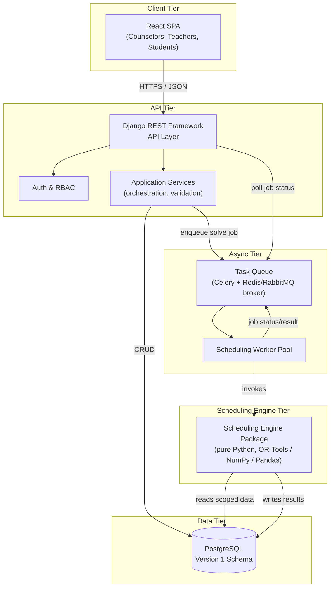
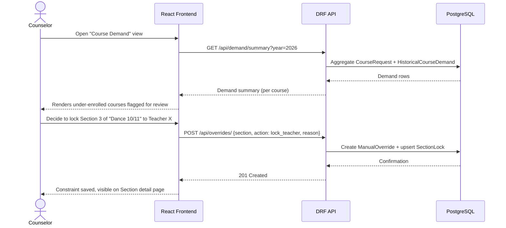
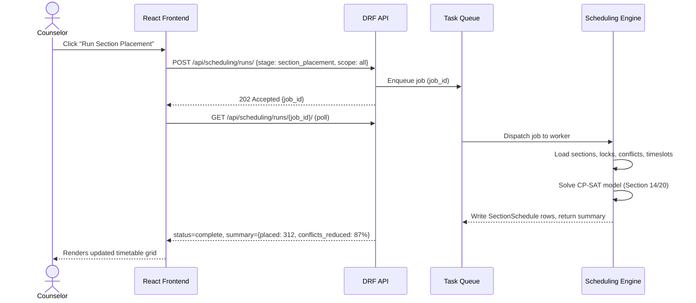
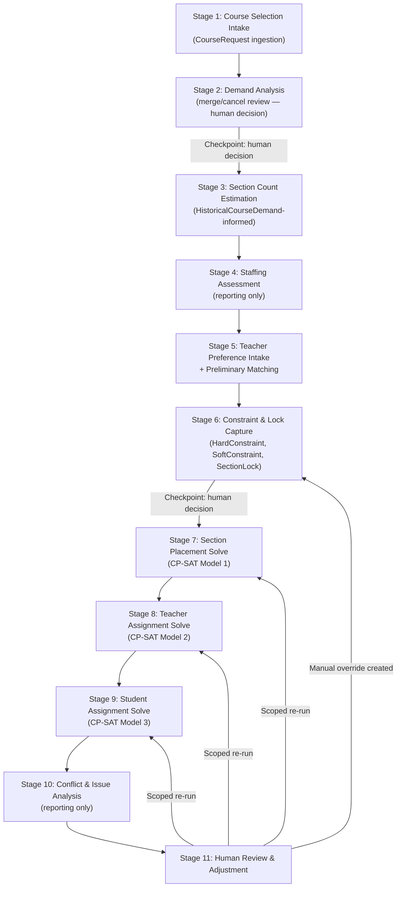
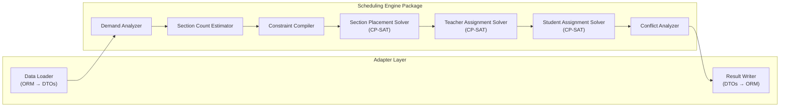
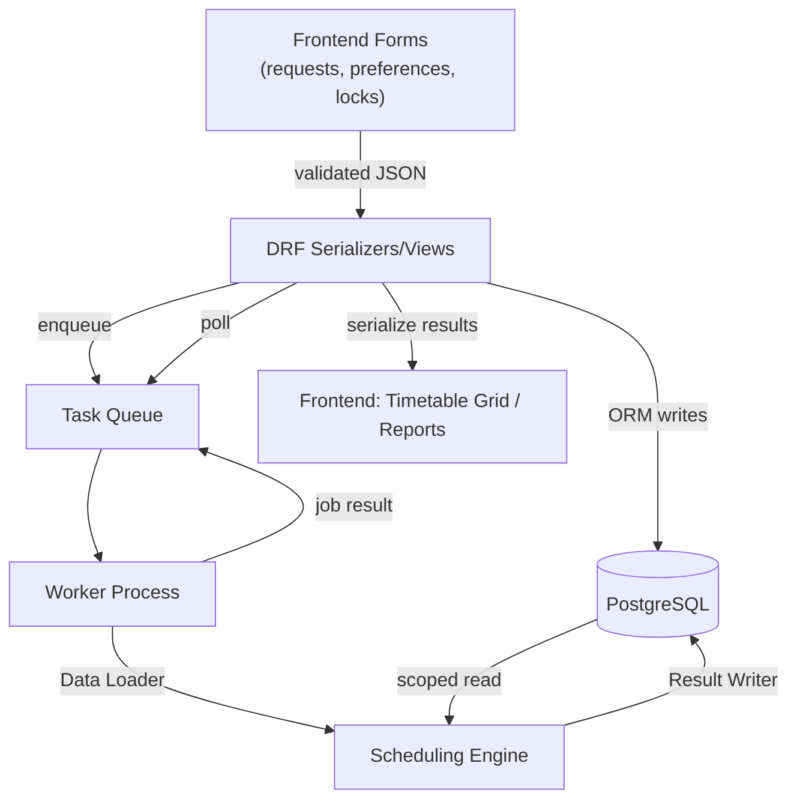
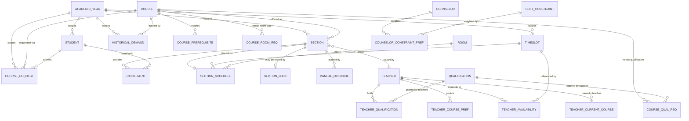
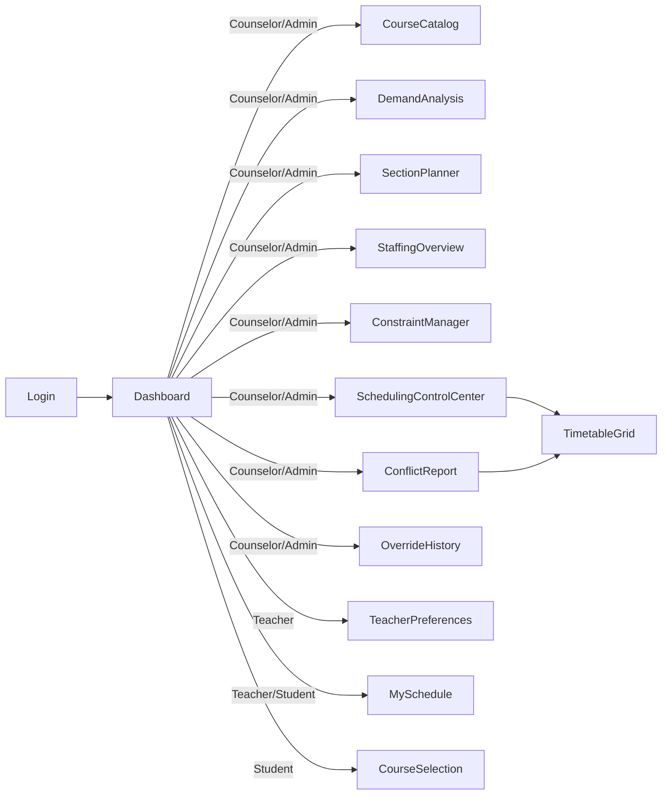
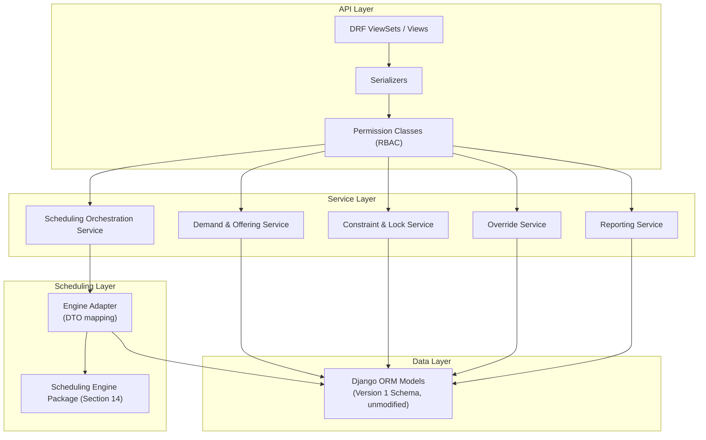
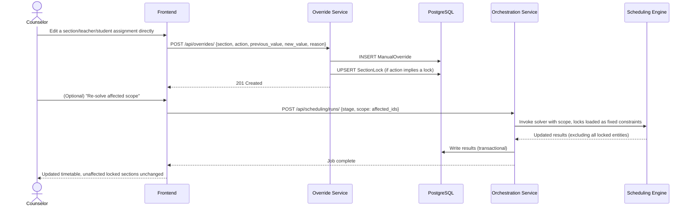

# Software Design Document
## Intelligent School Timetabling System (Ontario Secondary Schools)

**Document Type:** Software Design Document (SDD)
**Version:** 1.0
**Status:** Draft for Capstone / Portfolio Submission
**Target Scale:** ~1,400 students · ~80 teachers · 250–350 course sections per academic year

---

## Table of Contents

1. Executive Summary
2. Project Goals
3. Scope
4. Functional Requirements
5. Non-Functional Requirements
6. System Overview
7. High-Level Architecture
8. Architectural Principles
9. Major Components
10. Detailed Component Responsibilities
11. User Roles
12. User Workflows
13. Internal Scheduling Pipeline
14. Scheduling Engine Architecture
15. Data Flow
16. Database Integration
17. API Design
18. Frontend Architecture
19. Backend Architecture
20. Optimization Engine Architecture
21. Manual Override Workflow
22. Error Handling Strategy
23. Logging Strategy
24. Security Considerations
25. Performance Considerations
26. Scalability Considerations
27. Future Expansion
28. Risks and Trade-offs
29. Development Roadmap
30. Conclusion

---

## 1. Executive Summary

> **Current implementation supersession (2026-08-08):** Where this older SDD
> describes queue-first execution or combines rooms with the first placement
> solver, follow `Implementation_Roadmap.md` and
> `docs/decisions/semester-placement-and-staffing-feasibility.md` instead. The
> implemented stage runs synchronously with a bounded review-first workflow,
> places semester/A-D timing only, and uses anonymous staffing witnesses. It
> neither assigns rooms nor persists named teacher recommendations. Workers are
> deferred until representative benchmarks justify them.

Ontario secondary school timetabling is, in practice, a multi-week, multi-stakeholder planning exercise rather than a single computational event. Guidance counselors and administrators move through course-selection analysis, section-count planning, staffing evaluation, teacher assignment, constraint gathering, timetable construction, and iterative correction — often revisiting earlier stages as new information surfaces. Existing tools in this space tend to fall into one of two unsatisfying categories: fully manual spreadsheet-based processes that do not scale past a few hundred students, or "black box" optimizers that produce a single output schedule with no support for the iterative, human-in-the-loop process that schools actually follow.

This document specifies the software architecture for a decision-support timetabling system that automates the computationally difficult and repetitive parts of this process — demand analysis, section placement, teacher-to-section assignment, and student-to-section assignment — while preserving guidance counselors as the final authority over every consequential decision. The system is explicitly **not** designed to produce a final, unreviewable timetable. It is designed to produce strong candidate schedules quickly, to surface exactly the conflicts and edge cases that require human judgment, and to let counselors lock in decisions that the optimizer must then treat as immovable constraints on every subsequent run.

Architecturally, the system separates into four major tiers: a React single-page frontend used by counselors, administrators, teachers, and (in a limited capacity) students; a Django REST Framework API tier responsible for authentication, validation, and orchestration; a standalone scheduling engine built on Google OR-Tools CP-SAT that is intentionally decoupled from the web tier so it can be invoked as a background job, tested in isolation, and evolved independently; and a PostgreSQL database whose Version 1 schema (provided as the source of truth for this document) captures courses, sections, people, constraints, and scheduling state.

The central architectural decision underlying this document is that **scheduling is a pipeline of independently executable, human-checkpointed stages**, not a single monolithic solve. This mirrors the eleven-step process the school actually follows (Section 13) and is the reason the scheduling engine (Section 20) is decomposed into discrete solver modules rather than one large constraint model. This decision directly satisfies two of the project's stated design principles: that manual counselor decisions must always override automatic scheduling, and that every optimization stage should be independently executable.

## 2. Project Goals

The system exists to assist, not replace, the guidance counselors and administrators who currently run the timetabling process manually. The following goals, drawn directly from the project context, govern every architectural decision in this document:

| Goal | Description |
|---|---|
| Decision support, not automation-only | The counselor remains the final authority; the system proposes, the human disposes. |
| Automate repetitive work | Section-count estimation, conflict-minimizing placement, teacher/student assignment should not require manual spreadsheet work. |
| Preserve human control | Every automated decision must be overridable, and overrides must be durable across re-runs. |
| Scale to a mid-size Ontario high school | ~1,400 students, ~80 teachers, 250–350 sections, two semesters (Fall/Winter). |
| Serve as a professional portfolio project | The codebase and architecture should reflect industry-grade engineering practice, not a classroom prototype. |

A secondary, implicit goal is **auditability**: because scheduling decisions affect students' academic trajectories and teachers' workloads, the system must be able to explain what it did and why, and must record who overrode what. This motivates the emphasis on structured logging (Section 23) and the manual override audit trail (Section 21), both of which are already partially reflected in the Version 1 schema via `ManualOverride`.

## 3. Scope

### 3.1 In Scope (Version 1)

- Ingesting student course requests (primary and alternate) and teacher preferences.
- Demand analysis and section-count recommendation, informed by historical enrollment data.
- Constraint capture: hard constraints (qualifications, capacity, conflicts), soft constraints (preferences, balance), and manual locks (fixed teacher, fixed timeslot, fixed room).
- Automated section placement into semesters and timeslots, minimizing high-impact scheduling conflicts.
- Automated teacher-to-section assignment respecting qualifications, availability, workload limits, and preferences.
- Automated student-to-section assignment respecting prerequisites, capacity, and schedule conflicts.
- Post-solve conflict and issue analysis (under-enrolled sections, unmet requests, teacher overload, etc.).
- A manual override and re-run workflow that lets counselors adjust the schedule without discarding prior work.
- Role-based frontend views for counselors/administrators, teachers, and students.
- Bilingual (English/French) UI text via the existing `Translation` model.

### 3.2 Out of Scope (Version 1)

The following are explicitly deferred to later phases (Section 27) and are called out so that the architecture does not implicitly assume them:

- Automatic import of teacher qualifications from external HR/SIS systems (the process document notes this "may potentially" happen; V1 assumes manual or CSV-based entry).
- Natural-language parsing of free-text teacher preferences (V1 assumes the frontend collects preferences as structured course selections at the point of entry — see Section 3.3).
- Multi-year or multi-school forecasting/analytics.
- AI-assisted or explainable scheduling (Section 27).
- Direct integration with provincial Student Information Systems (SIS).
- Real-time collaborative editing (two counselors editing the same section simultaneously); V1 uses optimistic concurrency and last-write-wins semantics with audit logging.

### 3.3 Assumption — Structured Preference Capture

**Assumption:** Although the current manual process collects teacher preferences as free text (e.g., "Grade 12 Calculus"), the `TeacherCoursePreference` model in the Version 1 schema stores a foreign key to a specific `Course`. This document assumes the frontend replaces free-text collection with a structured, searchable course picker at data-entry time, so that no free-text normalization step is required in V1. This is a reasonable assumption because it requires no schema change, eliminates an entire class of data-quality bugs, and the "future improvement" of NLP-based free-text ingestion is explicitly reserved for Section 27.

## 4. Functional Requirements

| ID | Requirement | Related Process Step |
|---|---|---|
| FR-1 | The system shall allow students (or staff on their behalf) to submit primary and alternate course requests per academic year. | Step 1 |
| FR-2 | The system shall compute aggregate demand per course and flag under-enrolled courses for merge/cancel review. | Step 2 |
| FR-3 | The system shall recommend a number of sections per course based on requests, historical drop/add trends, and configured min/max capacities. | Step 3 |
| FR-4 | The system shall produce a staffing summary showing required sections per subject against available qualified teachers. | Step 4 |
| FR-5 | The system shall allow teachers to submit structured course preferences and current-course history. | Step 5 |
| FR-6 | The system shall allow counselors to define manual locks (teacher, timeslot, room, capacity) and soft prerequisite relationships prior to automated placement. | Step 6 |
| FR-7 | The system shall automatically place sections into semesters/timeslots to minimize high-impact conflicts between commonly co-requested courses. | Step 7 |
| FR-8 | The system shall automatically assign teachers to sections respecting qualifications, availability, workload caps, and preferences. | Step 8 |
| FR-9 | The system shall automatically assign students to sections respecting prerequisites, capacity, and individual schedule conflicts, maximizing primary-choice fulfillment. | Step 9 |
| FR-10 | The system shall generate a structured report of unresolved issues (under-enrolled sections, unmet requests, teacher overload, capacity overflows). | Step 10 |
| FR-11 | The system shall allow counselors to manually reassign students/teachers/sections and selectively re-run only the affected portion of the pipeline. | Step 11 |
| FR-12 | The system shall persist every manual override with a reason, previous value, and new value for auditability. | Step 6, 11 |
| FR-13 | The system shall present bilingual (EN/FR) UI text using the existing translation store. | Cross-cutting |
| FR-14 | The system shall allow authenticated teachers and students to view (read-only) their own finalized schedules. | Cross-cutting |

## 5. Non-Functional Requirements

| Category | Requirement |
|---|---|
| Performance | A full section-placement solve for 250–350 sections should complete within a bounded time window (target: under 5 minutes; see Section 25) using a time-boxed CP-SAT solver configuration. |
| Scalability | The architecture must handle the target school size today and scale horizontally to larger schools (multiple campuses, 2,000+ students) without architectural rework. |
| Maintainability | The scheduling engine must be a separately versioned, independently testable package with no Django/DRF import dependencies, per the stated design principle. |
| Extensibility | New constraint types, new solver stages, and new AI-assisted modules must be addable without modifying existing solver stages (open/closed principle applied at the pipeline level). |
| Auditability | Every automated and manual scheduling decision must be traceable to a cause (a solver run, an override, or a locked constraint). |
| Availability | The web tier should degrade gracefully if the scheduling engine is unavailable (CRUD operations continue to function; only "run solver" actions are blocked). |
| Internationalization | All user-facing strings must be resolvable through the `Translation` model rather than hard-coded. |
| Usability | Counselors, who are not software engineers, must be able to understand *why* the solver made a given placement, at least at a summary level (see Section 27 for future explainability work). |

## 6. System Overview

The system is a web application composed of a React frontend, a Django REST Framework backend, a PostgreSQL database, and a decoupled scheduling engine built on Google OR-Tools. It is used in three broad modes:

1. **Data collection mode** (Steps 1, 5, 6 of the process): counselors, students, and teachers enter course requests, preferences, and constraints through the frontend, which the API persists directly to PostgreSQL. No optimization occurs in this mode.
2. **Solve mode** (Steps 3–4, 7–9): a counselor triggers one or more scheduling stages. The API enqueues a job; the scheduling engine reads the relevant subset of the database, solves, and writes results back. This mode is asynchronous because solver runtimes can exceed typical HTTP request timeouts.
3. **Review and adjustment mode** (Steps 10–11): counselors review system-generated conflict reports, make manual overrides, and selectively re-trigger solve mode for the affected scope only (e.g., re-solving student assignment for a single course without disturbing the entire timetable).

These three modes are not sequential phases of a project — they are recurring modes that a counselor moves between throughout the scheduling season, which is why the architecture treats "run the solver" as a repeatable, idempotent, scoped operation rather than a one-time migration step.


## 7. High-Level Architecture

The architecture follows a **decoupled-engine, layered-service** pattern. The scheduling engine is drawn as a distinct tier — not a module inside the Django app — because it has different runtime characteristics (CPU-bound, long-running, potentially horizontally scaled on its own) and different lifecycle needs (must be independently testable without a running web server, per the design principles).



**Why an asynchronous worker tier:** CP-SAT solves over 250–350 sections with hundreds of teacher/room/timeslot combinations are not guaranteed to complete within a typical HTTP request timeout (Section 25). Rather than force the frontend to hold open a long-lived connection, the API enqueues a job and returns immediately with a job identifier; the frontend polls (or subscribes via WebSocket in a future iteration) for completion. This is a standard pattern for long-running compute in a request/response web architecture and keeps the API tier stateless and horizontally scalable.

**Why the scheduling engine has no Django dependency:** the design principles explicitly require that the scheduling engine be separated from the REST API. Beyond that requirement, a plain-Python engine can be unit-tested with in-memory fixtures in milliseconds, can be profiled and optimized without booting a Django app, and could in principle be extracted into its own microservice or even its own repository without touching the web tier.

## 8. Architectural Principles

| Principle | Rationale |
|---|---|
| **Separation of orchestration from computation** | The Django API decides *when* and *what scope* to solve; the scheduling engine decides *how*. This keeps solver logic testable in isolation and keeps the API layer thin. |
| **Pipeline over monolith** | The scheduling problem is decomposed into the discrete stages the school itself already uses (Section 13), rather than one enormous constraint model. This matches the stated principle that every optimization stage must be independently executable, and it makes partial re-runs (Section 21) tractable. |
| **Manual overrides are first-class, immutable constraints** | Once a counselor locks a decision (`SectionLock`, `ManualOverride`), every downstream solver stage must treat it as a hard constraint, never as a preference to optimize against. |
| **Idempotent, scoped re-computation** | Re-running a stage for a subset of sections/students must not silently disturb unrelated, already-accepted parts of the schedule. |
| **Schema stability** | The Version 1 database schema is treated as the source of truth. Architecture is designed around it; the schema is not redesigned except where explicitly flagged as a serious gap (Sections 3.3, 23, 24). |
| **Progressive enhancement toward AI** | Every stage exposes clean input/output boundaries (Section 20) so that a future ML-based module (e.g., demand forecasting) can replace a heuristic module without touching neighboring stages. |
| **Explainability over black-box optimization** | Wherever the solver makes a placement or assignment decision, the system should be able to report the constraints and objective terms that drove it, even if only at a summary level in V1 (full explainability is a Section 27 future item). |

## 9. Major Components

### 9.1 Frontend
A React single-page application serving three role-based experiences (counselor/admin, teacher, student) built around a shared component library. Responsible for data entry, visualization of the timetable, conflict/issue review, and triggering (and monitoring) scheduling runs.

### 9.2 Backend
A Django + Django REST Framework application responsible for authentication/authorization, request validation, CRUD persistence, orchestration of scheduling jobs, and generation of reports (staffing summaries, conflict reports). It does **not** contain optimization logic.

### 9.3 Database
PostgreSQL, using the Version 1 schema provided (Section 16). Organized conceptually into five groups: Core Domain (courses, sections, enrollments, requests, prerequisites), People (students, teachers, counselors), Scheduling Control (timeslots, section schedules, locks, overrides), Constraints (hard/soft constraints, qualifications, conflicts, preferences, availability), and Supporting Data (rooms, academic years, translations, historical demand).

### 9.4 Scheduling Engine
A standalone Python package built on Google OR-Tools CP-SAT, NumPy, and Pandas. Implements the multi-stage pipeline described in Sections 13–14 and 20. Invoked exclusively through a narrow, versioned interface (input DTOs in, result DTOs out), never through direct database access from arbitrary callers.

### 9.5 Supporting Services
Cross-cutting services consumed by both the API and the frontend: authentication/RBAC, the task queue/broker, structured logging and audit trail, the translation/i18n service, and (in later phases) analytics and notification services.

## 10. Detailed Component Responsibilities

| Component | Responsibilities | Explicit Non-Responsibilities |
|---|---|---|
| Frontend | Render role-appropriate UI; client-side validation; visualize timetable grids and conflict reports; trigger and poll scheduling jobs; manage transient UI state. | Must not contain scheduling business logic (e.g., must not compute conflicts client-side — it renders what the API returns). |
| API Layer (DRF) | Authentication, authorization, serialization, request validation, pagination/filtering, enqueueing scheduling jobs, exposing job status. | Must not implement constraint-solving logic. |
| Application Services | Encapsulate multi-step business operations that span multiple models (e.g., "apply a manual override," "compute a staffing summary") behind a clean service-layer API consumed by DRF views. | Must not talk to OR-Tools directly; delegates to the scheduling engine for anything solver-related. |
| Scheduling Engine | Demand analysis, section-count estimation, constraint compilation, all CP-SAT solver stages, conflict analysis. | Must not perform authentication, must not know about HTTP, must not directly serve API responses. |
| Task Queue / Worker Pool | Reliable, at-least-once execution of scheduling jobs; job status tracking; horizontal scaling of solver capacity. | Must not contain business logic beyond invoking the engine and reporting status. |
| Database | Durable, consistent storage of all domain and scheduling-control data; enforcement of referential integrity and uniqueness constraints already defined in the Version 1 schema. | N/A |
| Supporting Services | Cross-cutting concerns (auth, i18n, logging) reusable by every other component. | Must not embed feature-specific business rules. |

## 11. User Roles

| Role | Schema Mapping | Primary Capabilities |
|---|---|---|
| **Counselor / Administrator** | `Counselor` model, with `is_staff`/`is_superuser` Django auth flags distinguishing elevated "Administrator" privileges (see Assumption below) | Full read/write access to demand analysis, staffing, constraints, manual locks/overrides, and triggering scheduling runs. |
| **Teacher** | `Teacher` model | Submits course preferences and current-course history; views own qualifications, availability, and finalized assigned sections; cannot modify the schedule directly. |
| **Student** | `Student` model | Submits primary/alternate course requests; views own finalized timetable; cannot modify assignments directly. |

**Assumption — Administrator as a Privilege Level, Not a New Table:** the Version 1 schema models `Counselor` but has no distinct `Administrator` entity. Rather than add a new domain table, this document assumes "Administrator" is implemented as a Django auth privilege level (`is_staff`/`is_superuser`) layered on top of a `Counselor` (or a plain Django `User` with no `Counselor` profile, for pure system-configuration accounts). This is reasonable because Administrator differs from Counselor only in *system-configuration* scope (managing rooms, academic years, translations, qualifications) rather than in *domain* scope, and it avoids any schema change.

**Assumption — Identity/Auth Linkage:** the schema defines `Student`, `Teacher`, and `Counselor` as domain profile tables, but does not define an authentication/`User` table. This document assumes Django's built-in `User` model is extended with an optional one-to-one relationship to exactly one of `Student`, `Teacher`, or `Counselor`, and that this linkage table is an additive schema change (a new join, not a redesign of existing tables). This is the conventional Django pattern for separating authentication identity from domain profile data and is the minimum change necessary to support login (Section 24).


## 12. User Workflows

### 12.1 Workflow: Counselor Reviews Demand and Locks a Constraint



### 12.2 Workflow: Running the Section Placement Stage



### 12.3 Workflow Summary Table

| Workflow | Primary Actor | Trigger | Key Output |
|---|---|---|---|
| Course selection intake | Student (or staff proxy) | Start of scheduling season | `CourseRequest` rows |
| Demand & offering review | Counselor | After request deadline | Merge/cancel decisions, updated `Course` records |
| Section count planning | Counselor (assisted) | After offering finalized | Recommended `Section` counts |
| Staffing review | Counselor/Admin | After section counts set | Staffing summary report (no schema write) |
| Teacher preference intake | Teacher | Start of scheduling season | `TeacherCoursePreference`, `TeacherCurrentCourse` |
| Constraint & lock capture | Counselor | Before automated placement | `HardConstraint`, `SoftConstraint`, `SectionLock`, `CourseConflict` |
| Section placement run | Counselor | On demand | `SectionSchedule` (timeslot/room) |
| Teacher assignment run | Counselor | On demand, after placement | `Section.teacher` |
| Student assignment run | Counselor | On demand, after teacher assignment | `Enrollment` |
| Conflict/issue review | Counselor | After any solve | Read-only report |
| Manual override & partial re-run | Counselor | Ongoing, through start of year | `ManualOverride`, scoped re-solve |

## 13. Internal Scheduling Pipeline

This section maps the eleven-step manual process described in the project context directly onto system stages. This mapping is the backbone of the entire scheduling engine design (Section 14, 20) and is intentionally **not** collapsed into fewer stages, because the design principle requires every optimization stage to be independently executable and because counselors need checkpoints matching their existing mental model of the process.



**Why the feedback loop from Stage 11 back into Stages 6–9:** the process document is explicit that human review "often continues until the beginning of the school year and sometimes even after classes have started," and that adjustments may require regenerating "only affected portions" of the timetable. The pipeline therefore is not a straight line — Stage 11 can re-enter at Stage 6 (a new lock is added) or re-trigger any of Stages 7–9 with a narrowed scope (e.g., re-solve student assignment only for one course), rather than restarting the entire pipeline. This scoped re-entry is what Section 21 formalizes as the Manual Override Workflow.

Stages 1, 2, 4, 5 (intake and reporting stages) require no optimization and are handled entirely by the API/service layer against the database. Stages 3, 7, 8, 9 are the computationally significant stages and are the ones delegated to the scheduling engine (Section 14). Stage 10 is a read-only aggregation over the results of Stages 7–9 and the constraint tables.


## 14. Scheduling Engine Architecture

The scheduling engine is a standalone Python package (conceptually named `scheduling_engine/`) with **zero import dependency on Django**. It communicates with the rest of the system only through plain Python data structures (dataclasses / DTOs) that a thin adapter layer populates from, and writes back to, the Django ORM. This boundary is what makes the engine independently testable and independently deployable, satisfying the stated design principle directly.



### 14.1 Module Responsibilities

| Module | Responsibility | Solver Technology |
|---|---|---|
| Demand Analyzer | Aggregates `CourseRequest` by course; joins against `HistoricalCourseDemand` to flag under-enrolled courses and suggest merge candidates. | Pandas aggregation, no solver |
| Section Count Estimator | Given finalized offerings, estimates section counts using request volume, historical drop-rate ratios, and configured min/max capacities. | NumPy/Pandas heuristic, no CP-SAT |
| Constraint Compiler | Reads `HardConstraint`, `SoftConstraint`, `SectionLock`, `CourseConflict`, `TeacherQualification`, `TeacherAvailability`, `CourseRoomRequirement`, `CourseQualificationRequirement`, `CoursePrerequisite` and compiles them into an in-memory constraint set consumable by every downstream solver. | Pure Python |
| Section Placement Solver | Assigns each `Section` a `TimeSlot` (and `Room`), minimizing weighted co-request conflicts and maximizing distribution of multi-section courses across periods. | OR-Tools CP-SAT |
| Teacher Assignment Solver | Assigns a `Teacher` to each unlocked `Section`, respecting qualifications, availability, workload caps (`max_courses_per_semester`, `max_courses_total`), seniority, and preference weighting. | OR-Tools CP-SAT |
| Student Assignment Solver | Assigns each `Student`'s `CourseRequest`s to specific `Section`s (creating `Enrollment` rows), respecting prerequisites, capacity, and per-student schedule conflicts; maximizes primary-choice fulfillment. | OR-Tools CP-SAT |
| Conflict Analyzer | Post-solve read-only pass producing the Stage 10 issue report (Section 13). | Pandas aggregation, no solver |

### 14.2 Why Three Separate CP-SAT Models Instead of One

A single combined model (sections + teachers + students solved jointly) is theoretically capable of a more globally optimal schedule, but was rejected for three concrete reasons:

1. **Independent executability.** The design principle requires each optimization stage to run independently — a counselor may want to re-run only student assignment after manually correcting a few teacher assignments, without re-solving placement.
2. **Search space tractability.** The combined problem's search space grows multiplicatively (sections × timeslots × teachers × students), which risks solver runtimes that violate the performance targets in Section 25 at this scale (250–350 sections, 1,400 students). Decomposing into three sequential CP-SAT models — each with a search space bounded by only its own variables — keeps each solve well within CP-SAT's practical performance envelope.
3. **Matches the human process.** Steps 7, 8, and 9 of the actual school process are already sequential and separately reviewable by staff. A decomposed engine lets the system produce and surface intermediate results (e.g., "sections are placed, review before assigning teachers") exactly where the human process already pauses.

The trade-off — a decomposed pipeline can produce a locally-optimal-but-not-globally-optimal schedule compared to a joint solve — is discussed explicitly in Section 28.

## 15. Data Flow



Data moves through the system in two distinct patterns:

- **Synchronous CRUD flow:** used for all Stage 1, 2 (decision only), 4, 5, 6, 10, 11 interactions — a direct request/response cycle between the frontend, the DRF API, and PostgreSQL, with no involvement of the scheduling engine.
- **Asynchronous solve flow:** used for Stages 3, 7, 8, 9 — the API enqueues a scoped job description (which sections/students/teachers are in scope, which stage to run), a worker invokes the engine, the engine reads only the data within scope, solves, and writes results back inside a single database transaction so that a failed or interrupted solve never leaves partially-applied results (Section 22).


## 16. Database Integration

The Version 1 schema is treated as the authoritative source of truth for this document, per the project's stated constraint. This section explains how the architecture integrates with it rather than proposing changes to it. The schema is organized here into five conceptual groups purely for architectural discussion — this grouping does not correspond to Django "apps" necessarily, though it is a reasonable candidate structure (Section 19).

### 16.1 Conceptual Groups

| Group | Models |
|---|---|
| Core Domain | `Course`, `Section`, `Enrollment`, `CourseRequest`, `CoursePrerequisite` |
| People | `Student`, `Teacher`, `Counselor` |
| Scheduling Control | `TimeSlot`, `SectionSchedule`, `ManualOverride`, `SectionLock` |
| Constraints | `HardConstraint`, `SoftConstraint`, `CounselorConstraintPreference`, `Qualification`, `CourseRoomRequirement`, `CourseQualificationRequirement`, `CourseConflict`, `TeacherQualification`, `TeacherCoursePreference`, `TeacherAvailability`, `TeacherCurrentCourse` |
| Supporting Data | `Room`, `AcademicYear`, `Translation`, `HistoricalCourseDemand` |

### 16.2 Entity Relationship Diagram (Key Relationships)



### 16.3 Integration Notes by Group

- **Core Domain:** `Section.is_locked` is a fast, denormalized flag for query filtering; `SectionLock` holds the actual locked values (teacher/timeslot/room). The engine's Constraint Compiler (Section 14) treats any section with `is_locked=True` as fully excluded from the relevant solver's decision variables — it is loaded for context (e.g., counted against room/timeslot capacity) but never reassigned.
- **`CourseConflict` population strategy (architectural decision, not a schema change):** the schema provides a `CourseConflict(course_a, course_b, weight)` table but does not specify how weights are populated. This document specifies that the Demand Analyzer (Section 14) computes co-request frequency from `CourseRequest` during Stage 2/6 and **upserts** `CourseConflict` rows automatically, while still allowing counselors to manually override specific weights through the same table (the API endpoint in Section 17 exposes both read and manual-write access). This keeps the table schema unchanged while giving it a well-defined population mechanism.
- **Constraint Compiler reads, never the solver directly:** no CP-SAT solver module queries the ORM. All constraint tables are loaded once by the Constraint Compiler into plain-Python structures before any solver runs, which keeps the solver logic database-agnostic and unit-testable with fixtures instead of a real database.
- **`HistoricalCourseDemand` as the sole forecasting input in V1:** the Section Count Estimator (Stage 3) is intentionally a simple, explainable heuristic (ratio of historical `final_enrollment` to historical `requests`, applied to current-year `requests`) rather than a machine-learning model, consistent with the "maintainability over premature optimization" design principle. Section 27 discusses replacing this heuristic with an ML forecasting module without changing its input/output contract.

## 17. API Design

The API is organized by feature area, following REST conventions under Django REST Framework. Endpoints are grouped below by the pipeline stage they primarily support (Section 13). Implementation code is intentionally omitted; only responsibilities are described.

### 17.1 Course & Offering Management

| Method | Endpoint | Responsibility |
|---|---|---|
| GET/POST | `/api/courses/` | List/create courses (admin-only write). |
| GET/PATCH | `/api/courses/{id}/` | Retrieve/update a course, including cancel/merge flags. |
| GET/POST | `/api/courses/{id}/prerequisites/` | Manage `CoursePrerequisite` relationships. |

### 17.2 Course Selection & Demand (Steps 1–2)

| Method | Endpoint | Responsibility |
|---|---|---|
| GET/POST | `/api/course-requests/` | Students (or staff proxy) submit primary/alternate requests. |
| GET | `/api/demand/summary/` | Aggregated demand per course for a given academic year, joined with historical trends; flags merge/cancel candidates. |

### 17.3 Section Planning & Staffing (Steps 3–4)

| Method | Endpoint | Responsibility |
|---|---|---|
| POST | `/api/scheduling/runs/` `{stage: "section_count_estimation"}` | Triggers the Section Count Estimator; returns recommendations (not auto-applied). |
| POST | `/api/sections/` | Counselor finalizes and creates `Section` records from recommendations. |
| GET | `/api/staffing/summary/` | Read-only report: required sections per subject vs. available qualified teachers. |

### 17.4 Teacher Preferences & Qualifications (Step 5)

| Method | Endpoint | Responsibility |
|---|---|---|
| GET/POST | `/api/teachers/{id}/preferences/` | Manage `TeacherCoursePreference`. |
| GET/POST | `/api/teachers/{id}/current-courses/` | Manage `TeacherCurrentCourse`. |
| GET/POST | `/api/teachers/{id}/qualifications/` | Manage `TeacherQualification`. |
| GET/POST | `/api/teachers/{id}/availability/` | Manage `TeacherAvailability`. |

### 17.5 Constraints & Manual Locks (Step 6)

| Method | Endpoint | Responsibility |
|---|---|---|
| GET/POST | `/api/constraints/hard/` | Manage `HardConstraint` catalog. |
| GET/POST | `/api/constraints/soft/` | Manage `SoftConstraint` catalog. |
| GET/POST | `/api/constraints/preferences/` | Manage `CounselorConstraintPreference` (per-counselor weighting). |
| GET/PATCH | `/api/sections/{id}/lock/` | Create/update a `SectionLock`. |
| GET/PATCH | `/api/course-conflicts/` | View/adjust `CourseConflict` weights (see Section 16.3). |
| GET/POST | `/api/course-room-requirements/` | Manage `CourseRoomRequirement`. |
| GET/POST | `/api/course-qualification-requirements/` | Manage `CourseQualificationRequirement`. |

### 17.6 Scheduling Runs (Steps 7–9)

| Method | Endpoint | Responsibility |
|---|---|---|
| POST | `/api/scheduling/runs/` `{stage, scope}` | Enqueue a scoped solver run for `section_placement`, `teacher_assignment`, or `student_assignment`. |
| GET | `/api/scheduling/runs/{job_id}/` | Poll job status and retrieve summary results. |
| GET | `/api/timetable/` | Retrieve the current composed timetable (sections + schedule + teacher). |

### 17.7 Conflict Analysis & Review (Steps 10–11)

| Method | Endpoint | Responsibility |
|---|---|---|
| GET | `/api/conflicts/report/` | Structured issue report: under-enrolled sections, unmet requests, teacher overload, capacity overflows. |
| GET/POST | `/api/overrides/` | Create/list `ManualOverride` records (with reason, previous/new value). |
| POST | `/api/overrides/{id}/apply/` | Apply an override and mark affected entities for scoped re-solve. |

### 17.8 Supporting Endpoints

| Method | Endpoint | Responsibility |
|---|---|---|
| GET/POST | `/api/rooms/`, `/api/timeslots/`, `/api/academic-years/` | Manage supporting reference data. |
| GET | `/api/translations/{key}/` | Resolve UI text by key/locale. |
| POST | `/api/auth/login/`, `/api/auth/refresh/` | Token-based authentication (Section 24). |
| GET | `/api/students/{id}/schedule/`, `/api/teachers/{id}/schedule/` | Read-only finalized schedule for self-service views. |


## 18. Frontend Architecture

### 18.1 Pages

| Page | Role(s) | Purpose |
|---|---|---|
| Dashboard | All | Role-appropriate summary (open tasks, pending overrides, job status). |
| Course Catalog & Offerings | Counselor/Admin | Manage `Course` records, prerequisites, merge/cancel decisions. |
| Course Selection | Student, Counselor (proxy) | Submit/edit `CourseRequest` rows. |
| Demand Analysis | Counselor/Admin | Aggregated demand view, merge/cancel candidates, historical comparison. |
| Section Planner | Counselor/Admin | Section count recommendations, finalize `Section` records. |
| Staffing Overview | Counselor/Admin | Read-only staffing summary report. |
| Teacher Preferences | Teacher | Submit preferences, current courses, availability. |
| Constraint & Lock Manager | Counselor/Admin | Manage hard/soft constraints, section locks, course conflicts. |
| Scheduling Control Center | Counselor/Admin | Trigger and monitor Stage 7–9 solver runs; view job progress. |
| Timetable Grid | Counselor/Admin, Teacher (own), Student (own) | Visualize placed sections, teacher assignments, student enrollments. |
| Conflict & Issue Report | Counselor/Admin | Stage 10 structured report with drill-down. |
| Override History | Counselor/Admin | Audit trail of `ManualOverride` records. |
| My Schedule | Teacher, Student | Read-only personal timetable. |

### 18.2 Navigation

Navigation is role-gated at the route level (a teacher never receives the routes for Constraint & Lock Manager, for example), implemented as a route configuration table consumed by a single `<AppRouter>` rather than duplicated per-role route trees. This keeps the frontend's route structure extensible — adding a new stage-specific page (e.g., a future analytics dashboard, Section 27) means adding one route/permission entry rather than modifying multiple role-specific routers.



### 18.3 State Management Recommendation

**Recommendation:** separate *server state* from *UI state* using two distinct tools rather than a single global store for everything:

- **Server state — React Query (TanStack Query):** all data that originates from the API (courses, sections, requests, constraints, job status) is cached, invalidated, and refetched through React Query. This is recommended because scheduling-run polling (Section 12.2) fits React Query's built-in polling/refetch-interval support naturally, and because it eliminates a large class of manual cache-invalidation bugs that a hand-rolled Redux data layer would otherwise require.
- **UI/local state — React Context + `useReducer` (or a lightweight store such as Zustand) for cross-page UI state:** things like "which sections are currently selected for a scoped re-run," or wizard step state in the Section Planner, which do not need to be persisted or synchronized with the server.

**Why not Redux for everything:** most of this application's complexity is server-state synchronization (exactly React Query's specialty), not complex client-only interaction state. Introducing a full Redux store for server data would mean re-implementing caching, invalidation, and loading/error states that React Query provides out of the box — extra code with no corresponding benefit, which conflicts with the "maintainability over premature optimization" principle.

### 18.4 Component Organization

```
src/
  api/               # Typed API client modules, one per feature area (Section 17)
  components/
    common/           # Buttons, tables, forms — shared design system
    timetable/         # Grid rendering, conflict highlighting
    constraints/       # Constraint/lock editors
    scheduling/        # Run trigger + job status components
  pages/               # One directory per page in Section 18.1
  hooks/               # useCourseRequests, useSchedulingRun, useOverrides, etc.
  state/               # Cross-page UI state (Context/Zustand)
  i18n/                # Translation resolution against /api/translations/
  routes/              # Central route/permission configuration (Section 18.2)
```

This structure groups by feature first, type second (a common alternative to a strict `components/`, `pages/`, `hooks/` top-level split by type only), so that a developer extending the Constraint Manager touches one directory rather than five.


## 19. Backend Architecture

The backend follows a layered architecture within a Django project, structured as several Django "apps" that mirror the conceptual groups in Section 16.1, plus a scheduling app that is a thin adapter over the standalone scheduling engine package.



### 19.1 Services

| Service | Responsibility |
|---|---|
| Demand & Offering Service | Course demand aggregation, merge/cancel workflow support. |
| Constraint & Lock Service | CRUD and validation for all constraint tables and `SectionLock`. |
| Scheduling Orchestration Service | Validates run requests, determines scope, enqueues jobs, tracks status, invokes the Engine Adapter. |
| Override Service | Validates and persists `ManualOverride`, determines the resulting re-solve scope, and triggers a scoped run via the Orchestration Service. |
| Reporting Service | Staffing summary, conflict/issue report, override history — all read-only aggregations. |

### 19.2 Modules (Suggested Django App Structure)

| App | Contains |
|---|---|
| `people` | `Student`, `Teacher`, `Counselor` and their auth linkage |
| `courses` | `Course`, `Section`, `Enrollment`, `CourseRequest`, `CoursePrerequisite`, `HistoricalCourseDemand` |
| `scheduling_control` | `TimeSlot`, `SectionSchedule`, `ManualOverride`, `SectionLock`, `Room`, `AcademicYear` |
| `constraints` | `HardConstraint`, `SoftConstraint`, `CounselorConstraintPreference`, `Qualification`, `CourseRoomRequirement`, `CourseQualificationRequirement`, `CourseConflict`, `TeacherQualification`, `TeacherCoursePreference`, `TeacherAvailability`, `TeacherCurrentCourse` |
| `scheduling_jobs` | Job orchestration, Engine Adapter, task definitions (no domain models beyond a possible additive job-log table, Section 23) |
| `i18n` | `Translation` |

This mapping is offered as a **recommendation**, not a schema requirement — Django app boundaries are a code-organization decision layered on top of the (unchanged) Version 1 schema, and models can be reassigned to apps without any migration impact as long as `db_table` naming is managed carefully.

### 19.3 API Layer

Thin: DRF ViewSets handle serialization, pagination, filtering, and permission checks, then delegate all non-trivial logic to the Service Layer. This keeps views testable with simple service mocks and keeps business logic out of HTTP-specific code.

### 19.4 Scheduling Layer

The Engine Adapter is the **only** code permitted to import both Django models and the scheduling engine package. It performs three jobs: (1) load the scoped subset of data into engine DTOs, (2) invoke the appropriate engine module, (3) write results back inside a single atomic transaction (Section 22). This narrow boundary is what enforces the "scheduling engine separated from REST API" design principle in practice, not just in intent.

### 19.5 Data Layer

The unmodified Version 1 ORM models. No repository-pattern abstraction is introduced in V1 beyond Django's own ORM, consistent with "maintainability over premature optimization" — an additional repository layer would add indirection without a concrete near-term benefit at this scale.


## 20. Optimization Engine Architecture

This section provides the detailed design of each computationally significant stage identified in Sections 13–14, specifying inputs, outputs, dependencies, and database interaction for each.

### 20.1 Section Count Estimator

| Aspect | Detail |
|---|---|
| Responsibilities | Estimate the number of sections needed per course from current requests and historical drop/add behavior. |
| Inputs | `CourseRequest` counts (current year), `HistoricalCourseDemand.requests`/`final_enrollment` (prior years), `Course.capacity_min`/`capacity_max`. |
| Outputs | Recommended section count per course (not auto-persisted — surfaced to the counselor for confirmation, per FR-3). |
| Dependencies | Pandas for aggregation; no CP-SAT (this is a heuristic ratio calculation, not a combinatorial optimization). |
| DB Interaction | Read-only against `courses` and `historical` tables; writes nothing directly (counselor confirmation creates `Section` rows via the standard Section API). |

### 20.2 Section Placement Solver (CP-SAT Model 1)

| Aspect | Detail |
|---|---|
| Responsibilities | Assign each unlocked `Section` a `(TimeSlot, Room)` pair. |
| Inputs | All `Section`s for the academic year (excluding those with `is_locked=True`, which are loaded as fixed context, not decision variables), available `TimeSlot`s, `Room`s (filtered by `CourseRoomRequirement` per course), `CourseConflict` weights, `SectionLock` values. |
| Decision Variables | For each unlocked section, a variable selecting one `(timeslot, room)` combination from its feasible set. |
| Hard Constraints | No two sections in the same room+timeslot; no two sections of a course whose combined student overlap makes co-scheduling infeasible are placed identically when alternatives exist; room type must satisfy `CourseRoomRequirement`; locked sections' slots are removed from the feasible pool of all other sections. |
| Objective | Minimize the sum of `CourseConflict.weight` over course pairs placed in the same timeslot, while rewarding spreading multiple sections of the same course across distinct periods. |
| Outputs | `SectionSchedule` rows (timeslot + room per section). |
| Dependencies | OR-Tools CP-SAT; output of the Constraint Compiler. |
| DB Interaction | Read-scoped per Section 16.3; writes `SectionSchedule` inside a single transaction (Section 22). |

### 20.3 Teacher Assignment Solver (CP-SAT Model 2)

| Aspect | Detail |
|---|---|
| Responsibilities | Assign a `Teacher` to each unlocked `Section` (post-placement). |
| Inputs | Placed `Section`s (from 20.2), `TeacherQualification`, `CourseQualificationRequirement`, `TeacherAvailability` (cross-referenced against each section's assigned `TimeSlot`), `TeacherCoursePreference`, `Teacher.seniority`, `Teacher.max_courses_per_semester`/`max_courses_total`, `Teacher.is_reduced_load`, existing `SectionLock.locked_teacher`. |
| Hard Constraints | A teacher is qualified for the course (via `CourseQualificationRequirement` ⊆ `TeacherQualification`); a teacher is available at the section's timeslot; a teacher is never assigned two sections at overlapping timeslots; workload caps are respected. |
| Soft Constraints (Objective Terms) | Maximize satisfied `TeacherCoursePreference`; balance workload distribution; weight by seniority where preferences conflict (using `CounselorConstraintPreference` weights). |
| Outputs | `Section.teacher` assignment. |
| Dependencies | OR-Tools CP-SAT; requires Section 20.2 to have completed for the sections in scope. |
| DB Interaction | Reads placed sections and constraint tables; writes `Section.teacher` inside a transaction. |

### 20.4 Student Assignment Solver (CP-SAT Model 3)

| Aspect | Detail |
|---|---|
| Responsibilities | Assign each student's course requests to specific sections, creating `Enrollment` rows. |
| Inputs | `CourseRequest` (primary/alternate) per student, placed+staffed `Section`s with their `TimeSlot`s, `Section.capacity_min`/`capacity_max`, `CoursePrerequisite`, `Student.grade_level`. |
| Hard Constraints | No two enrollments for a student at overlapping timeslots; section capacity not exceeded; prerequisites satisfied; mandatory (`CourseRequest.is_mandatory`) requests prioritized over optional ones. |
| Objective | Maximize the number of primary-choice requests fulfilled; minimize reliance on alternates; secondary objective to balance section fill levels between `capacity_min` and `capacity_max`. |
| Outputs | `Enrollment` rows. |
| Dependencies | OR-Tools CP-SAT; requires Section 20.2 and 20.3 to have completed for the sections in scope (student assignment does not strictly require a teacher to already be assigned, per the process document, but does require the section to be time-placed to check for student-level conflicts). |
| DB Interaction | Reads requests, placed sections, prerequisites; writes `Enrollment` inside a transaction. |

### 20.5 Conflict Analyzer

| Aspect | Detail |
|---|---|
| Responsibilities | Produce the Stage 10 issue report. |
| Inputs | Results of 20.2–20.4, `Section.capacity_min`/`max`, `CourseRequest`, `Teacher.max_courses_*`. |
| Outputs | Structured report: under/over-enrolled sections, students with incomplete schedules or unmet requests, teachers over their workload cap, unresolved capacity conflicts. |
| Dependencies | Pandas aggregation only; no solver. |
| DB Interaction | Read-only; result is not persisted as a new table in V1 (returned directly via `/api/conflicts/report/`), avoiding an unnecessary schema addition for what is fundamentally a derived view. |

### 20.6 Scope Parameter (Cross-Cutting)

Every solver invocation in Sections 20.2–20.4 accepts a **scope** parameter (a set of section IDs, course IDs, or student IDs) rather than always operating on the entire academic year. This is what makes Stage 11's "regenerate only affected portions" requirement (FR-11) architecturally possible: a scoped re-run loads only the sections/students in scope as decision variables while loading everything else as fixed context (identical treatment to how locked sections are handled in Section 20.2). Full-year runs are simply the special case where scope equals "all."

## 21. Manual Override Workflow



Two `ManualOverride.action` values map directly onto the schema's `lock_teacher`, `lock_timeslot`, and `move_section` conventions. Every override write is paired with a `SectionLock` upsert so the same fact is queryable both as a chronological audit event (`ManualOverride`) and as a current-state constraint (`SectionLock`) without duplicating logic across the two. **Design decision:** overrides are additive/append-only (never edited or deleted) so that `ManualOverride` functions as a complete audit trail, while `SectionLock` is mutable "current state" — this matches the existing schema shape (one is a `TextField`-based log, the other a structured current-value table) rather than requiring a change to either.


## 22. Error Handling Strategy

| Error Category | Example | Handling Approach |
|---|---|---|
| Validation errors (API layer) | Invalid course code, duplicate `CourseRequest` violating the unique constraint | DRF serializer validation returns 400 with field-level errors; no partial writes. |
| Business rule violations (Service layer) | Locking a section to a teacher who lacks the required qualification | Service layer raises a domain exception caught by a shared DRF exception handler, returned as 422 with a human-readable reason (translatable via `Translation`). |
| Solver infeasibility | No feasible teacher assignment exists given current locks/availability | The Scheduling Orchestration Service surfaces the specific conflicting hard constraints (e.g., "no available qualified teacher for Section X at its assigned timeslot") rather than a generic solver error, using CP-SAT's constraint-conflict introspection where available; job status is marked `failed_infeasible`, not silently retried. |
| Solver timeout | A full-year solve exceeds the configured time budget (Section 25) | The solver returns the best feasible solution found within the time budget (CP-SAT supports this natively) rather than failing outright; the job is marked `completed_suboptimal` and the summary flags this explicitly so the counselor knows further manual review is warranted. |
| Transactional failure mid-write | Worker process crashes after solving but before persisting results | Results are written in a single atomic database transaction (Section 19.4); a crash before commit leaves the database in its pre-run state, and the job is marked `failed` for a clean retry. |
| Concurrent edits | Two counselors edit the same section around the same time | Optimistic concurrency using a version/updated-at check on write; the losing writer receives a 409 with the current server state, prompting a merge rather than silently discarding one edit. |
| Downstream service unavailable | Task queue/broker is down | CRUD operations continue to function (per NFR "Availability"); only "trigger a solve" actions are disabled in the UI with a clear status indicator. |

**Guiding principle:** the system never silently produces a partially-applied or ambiguous state. Every solver run either fully commits a coherent result set or commits nothing; every override is either fully recorded (log + lock) or not recorded at all.

## 23. Logging Strategy

| Log Category | Content | Mechanism |
|---|---|---|
| Request/Audit logs | Every mutating API call (who, what endpoint, what changed) | Structured JSON logging middleware at the DRF layer, correlated with a request ID. |
| Domain audit trail | Manual overrides specifically | Already modeled via `ManualOverride` (action, previous/new value, reason, timestamp) — no additional logging infrastructure needed for this category since it is a first-class table. |
| Scheduling job logs | Job lifecycle (enqueued, started, completed/failed, duration, scope, summary stats) | Structured logs emitted by the worker, correlated by `job_id`; forwarded to a centralized log aggregator (e.g., the organization's existing ELK/CloudWatch stack). |
| Solver diagnostic logs | CP-SAT solve statistics (branches explored, time to first solution, objective value, infeasibility certificates) | Captured at DEBUG level within the scheduling engine, written to the job log record for troubleshooting without being surfaced to end users. |
| Error logs | Unhandled exceptions across all tiers | Standard Python/Django logging with severity levels, alerting integration reserved for a future operational maturity phase. |

### 23.1 Assumption — Optional Additive `SchedulingRunLog` Table

**Assumption/Recommendation:** the Version 1 schema has no dedicated table for scheduling job history (as distinct from `ManualOverride`, which logs human edits, not solver runs). This document recommends an **additive, non-breaking** future migration introducing a `SchedulingRunLog` table (job id, stage, scope, status, started_at, completed_at, summary JSON) to make job history queryable directly rather than relying solely on the task queue's transient result backend (e.g., Redis TTL-based result expiry). This is explicitly framed as an *addition*, not a redesign, and is deferred rather than mandated for V1 because the task queue's built-in result backend is sufficient to meet V1's functional requirements; it is flagged here so the development team can plan the migration proactively (Section 29).

## 24. Security Considerations

| Concern | Mitigation |
|---|---|
| Authentication | Token-based auth (DRF SimpleJWT or equivalent) against the auth linkage described in Section 11; no session-based auth to keep the API stateless and horizontally scalable. |
| Authorization / RBAC | Django permission classes enforce role-based access at the view level, using the Counselor/Teacher/Student/Administrator distinction from Section 11; students and teachers can only read their own `Enrollment`/`Section` data, never another individual's. |
| Data sensitivity | `Student.date_of_birth`, `Student.attendance_rate`, and email/phone fields across `Student`/`Teacher` are personally identifiable information; access to list/export endpoints is restricted to Counselor/Administrator roles, and field-level serialization hides these fields from Teacher/Student-facing responses entirely rather than merely hiding them in the UI. |
| Input validation | All writes pass through DRF serializers with explicit field validation; free-text fields (`ManualOverride.reason`, etc.) are stored but never interpolated into queries (parameterized ORM queries throughout, no raw SQL). |
| Transport security | HTTPS enforced end-to-end; the frontend never communicates with the API over plain HTTP even in development parity environments. |
| Least privilege for the scheduling worker | The worker process's database credentials are scoped to only the tables the engine adapter touches, separate from the general API service account, limiting blast radius if the worker environment is compromised. |
| Audit trail integrity | `ManualOverride` rows are append-only at the application layer (no update/delete exposed via the API) so the audit trail cannot be silently altered. |
| Secrets management | Database credentials, JWT signing keys, and broker credentials are supplied via environment variables/secret manager, never committed to source control. |

## 25. Performance Considerations

| Concern | Approach |
|---|---|
| Solver runtime bounds | Each CP-SAT solver stage (Section 20.2–20.4) is configured with a bounded time limit (e.g., a target of under 2 minutes for section placement, under 2 minutes for teacher assignment, under 3–4 minutes for the larger student assignment problem at 1,400 students), returning the best feasible solution found if the limit is reached, per the Error Handling Strategy (Section 22). |
| Scoped solving reduces typical-case runtime | Because most re-runs after the initial full solve are scoped (Section 20.6) to a handful of sections/students, the common case during the review-and-adjustment period (Stage 11) is a small, fast solve rather than a full 350-section solve. |
| Database indexing | Indexes on foreign keys already implied by Django's ORM defaults, plus targeted composite indexes on `(section, timeslot)` and `(student, section)` lookup paths used heavily by the Conflict Analyzer and Student Assignment Solver. |
| Read-heavy reporting endpoints | Demand summary, staffing summary, and conflict report endpoints use database-level aggregation (via the ORM's aggregation API) rather than pulling rows into Python and aggregating in application code. |
| Warm-starting future re-solves | The engine adapter can optionally seed a solver with the previous solution as hints (CP-SAT supports solution hints) when re-solving a narrow scope, reducing time-to-first-solution on incremental re-runs. |
| Frontend responsiveness during long solves | The asynchronous job pattern (Section 7) ensures the UI remains responsive during a multi-minute solve; polling interval backs off progressively to avoid excessive request volume. |

## 26. Scalability Considerations

| Dimension | Approach |
|---|---|
| API tier | Stateless DRF processes behind a load balancer scale horizontally with no code changes, since authentication is token-based rather than session-based. |
| Worker tier | The task queue/worker pool scales independently of the API tier; additional worker processes can be added to handle multiple concurrent scheduling runs (e.g., several counselors at different schools, if the system is later deployed board-wide). |
| Database | PostgreSQL read replicas can serve read-heavy reporting endpoints (Section 25) if load grows; the Version 1 schema's normalized structure and existing unique constraints support this without modification. |
| Problem size growth | At the target scale (1,400 students, 250–350 sections), all three CP-SAT models are well within CP-SAT's demonstrated practical capacity. Should the system be deployed at a significantly larger school or board-wide (multiple schools sharing the same instance), the scoping mechanism (Section 20.6) allows partitioning by school/academic year, and the Student Assignment Solver in particular may require decomposition into per-grade or per-cohort sub-problems solved independently — noted here as a scaling strategy rather than implemented in V1. |
| Multi-tenancy (future) | The current schema is single-school; extending to multiple schools would require adding a `School` foreign key across the People and Core Domain groups — flagged as a future, additive schema change rather than a V1 concern. |


## 27. Future Expansion

The architecture's stage-boundary design (Sections 14, 20) exists specifically so that each of the following can be introduced as a replacement or addition to a single module's implementation, without redesigning neighboring stages or the API contract around them.

| Future Capability | Integration Point | Description |
|---|---|---|
| AI-assisted demand forecasting | Replaces the Section Count Estimator (20.1) | An ML model trained on multi-year `HistoricalCourseDemand` could replace the ratio-based heuristic while keeping the same input/output contract (requests in, recommended section count out). |
| NLP-based teacher preference ingestion | Extends Stage 5 intake | Restores support for genuinely free-text preference entry (deferred in V1 per Section 3.3) by adding an NLP normalization step ahead of `TeacherCoursePreference` writes, with human confirmation of the mapped course. |
| Explainable scheduling | Extends every CP-SAT solver stage | Surfacing the specific binding constraints and objective-term contributions behind a given placement/assignment decision (CP-SAT exposes solution and constraint metadata that can be translated into counselor-readable explanations), directly addressing the "usability" non-functional requirement (Section 5) beyond V1's summary-level reporting. |
| Predictive analytics dashboards | New read-only service + pages | Trend analysis across academic years (enrollment shifts, section utilization, teacher workload trends) built on the same `HistoricalCourseDemand`-style data, extended to more entities. |
| Automated qualification import | Extends Teacher data intake | Integrating with the school's existing HR/administrative systems to auto-populate `TeacherQualification`, as the process document notes may already be feasible. |
| Multi-school / board-wide deployment | Extends People + Core Domain groups | Adding a `School` scoping dimension (Section 26) to support shared deployment across a district. |
| Real-time collaborative editing | Extends the Override Service | Moving from optimistic concurrency (Section 22) to operational-transform or CRDT-based conflict resolution if multiple counselors routinely edit concurrently. |

## 28. Risks and Trade-offs

| Risk / Trade-off | Discussion | Mitigation |
|---|---|---|
| Decomposed pipeline may miss globally optimal solutions | A single joint solve across placement, teachers, and students could in theory produce a better overall schedule than three sequential solves (Section 14.2). | Accepted trade-off in exchange for independent executability, tractable search spaces, and alignment with the human process; revisit only if solve quality proves insufficient in practice. |
| CP-SAT infeasibility on over-constrained inputs | Aggressive manual locking (Step 6) can produce a scope with no feasible solution. | Error Handling Strategy (Section 22) surfaces the specific conflicting constraints rather than a generic failure, letting the counselor relax a lock rather than guessing. |
| Reliance on historical data quality | The Section Count Estimator and conflict-weight computation both depend on `HistoricalCourseDemand` and `CourseRequest` being reasonably complete and accurate. | Flagged explicitly to stakeholders; the system should visibly indicate when historical data is sparse (e.g., a new course with no prior-year row) rather than silently defaulting. |
| Asynchronous job complexity | Introducing a task queue/broker adds an operational component (and a failure mode) that a purely synchronous system would not have. | Judged necessary given solver runtime bounds (Section 25) that would otherwise violate typical HTTP timeout expectations; kept as simple as possible (no custom job orchestration beyond a standard Celery-style queue). |
| Schema constraints on auth/administrator modeling | The Version 1 schema has no `User`/`Administrator` entities (Section 11), requiring additive assumptions. | Assumptions are documented explicitly and are additive-only, minimizing risk of schema churn later. |
| Scope creep toward "black box AI scheduling" | The temptation to over-automate could erode the "counselor stays in control" principle that is central to the project's goals. | Every solver-mutated field remains editable through the same API surface used for manual entry, and every override is a first-class, auditable action — automation augments rather than replaces the human workflow at every layer. |

## 29. Development Roadmap

| Phase | Scope | Rationale |
|---|---|---|
| **Phase 1 — Foundation** | Django project scaffolding per Section 19.2; Version 1 schema migrations; auth/RBAC (Section 24); CRUD API for Core Domain, People, and Supporting Data groups; basic React shell with routing (Section 18.2). | Establishes the data-entry backbone (Stages 1, 5, 6) with no optimization yet — the system is immediately useful as a structured replacement for spreadsheets. |
| **Phase 2 — Demand & Planning** | Demand Analyzer, Section Count Estimator, Staffing Overview reporting; Constraint & Lock Manager UI. | Delivers Stages 2–4 and 6, the analytical groundwork the solver stages depend on. |
| **Phase 3 — Core Scheduling Engine** | Scheduling engine package (Section 14) with the three CP-SAT solver stages; task queue integration; Scheduling Control Center UI; Conflict Analyzer and issue report. | Delivers the highest-value automation (Stages 7–9) and the Stage 10 review surface. |
| **Phase 4 — Override & Iteration Loop** | Manual Override Workflow (Section 21), scoped re-solve support (Section 20.6), Override History page. | Closes the loop described in Stage 11, making the system usable through the full, iterative real-world scheduling season rather than only for an initial "first draft" schedule. |
| **Phase 5 — Hardening & Polish** | Logging/audit completeness (Section 23, including the optional `SchedulingRunLog` addition), performance tuning against target solver time budgets (Section 25), bilingual UI completeness (Section 4, FR-13), security review (Section 24). | Brings the system to a production/portfolio-ready state. |
| **Phase 6 — Future Expansion (post-V1)** | Selected items from Section 27, prioritized by stakeholder value (forecasting and explainability are natural first candidates given they extend existing, well-bounded module contracts). | Explicitly deferred; V1's architecture is designed so none of these require structural rework. |

## 30. Conclusion

This document has specified an architecture for an intelligent, decision-support school timetabling system built around a central insight: Ontario secondary school scheduling is not a single optimization problem but an eleven-step, human-checkpointed process, and the software architecture should mirror that process rather than flatten it into one large solve. The resulting design — a React frontend, a thin Django REST Framework orchestration layer, a fully decoupled OR-Tools scheduling engine decomposed into independently executable stages, and the unmodified Version 1 PostgreSQL schema as the system of record — satisfies every stated design principle: manual decisions always override automation, every optimization stage runs independently, the scheduling engine is cleanly separated from the API, and the architecture leaves clear, additive extension points for the AI-assisted future work described in Section 27.

Where the provided schema did not fully specify a concern (authentication linkage, job history persistence, `CourseConflict` population), this document has made explicit, minimally invasive assumptions rather than silently redesigning existing tables, so that a development team can proceed directly to implementation with a clear record of every architectural decision and the reasoning behind it. The system, as specified, gives guidance counselors a tool that removes the tedious combinatorial burden of Ontario high school timetabling while leaving every consequential decision exactly where it belongs: in their hands.

---

## Implementation Supersession Note

The current implementation follows the newer decision records and architecture
rules where they differ from this original design. In particular, placement and
named teacher assignment are synchronous, review-first stages; accepted timing
is completed before named teacher approval; rooms are not part of either stage;
and student assignment is a later stage that depends on accepted section timing
rather than named teacher identity. Do not introduce a queue or room-coupled
solver solely because older sections of this document describe one.

---

*End of Software Design Document.*
